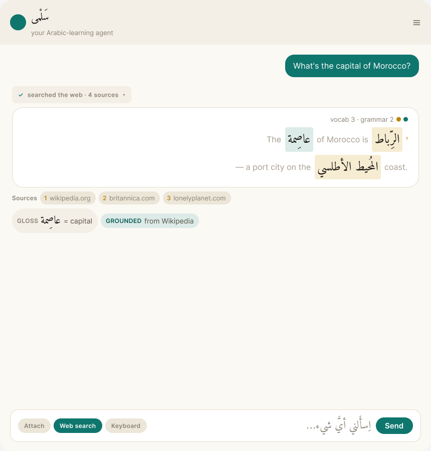
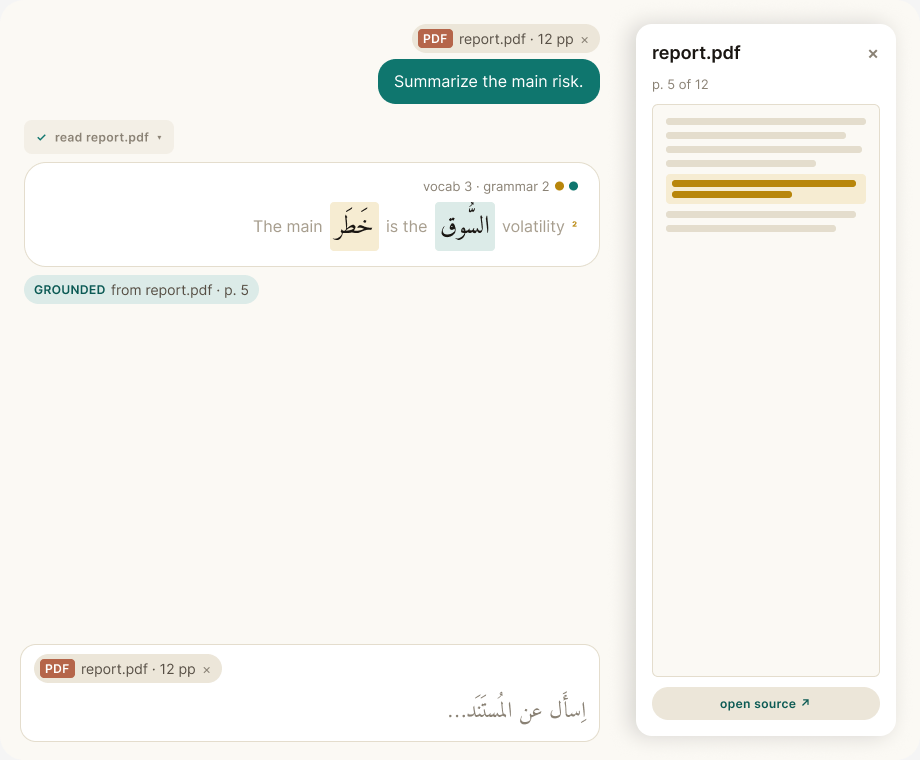
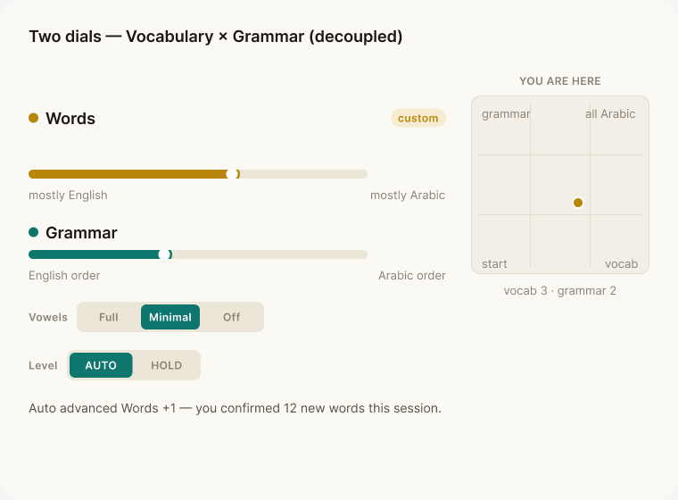
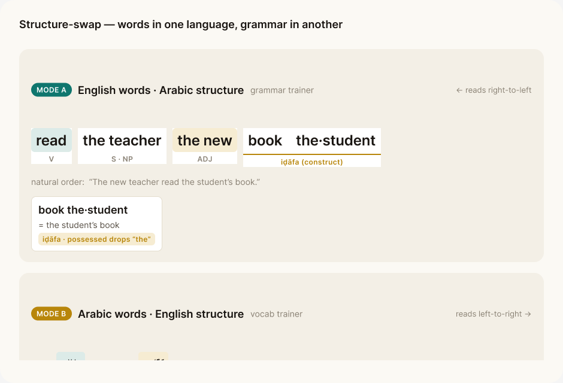
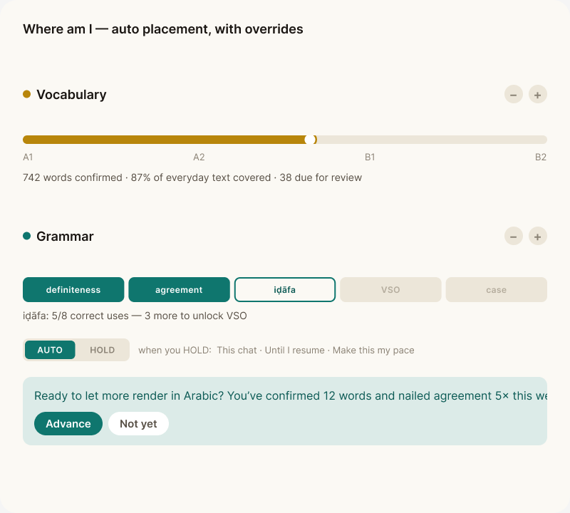
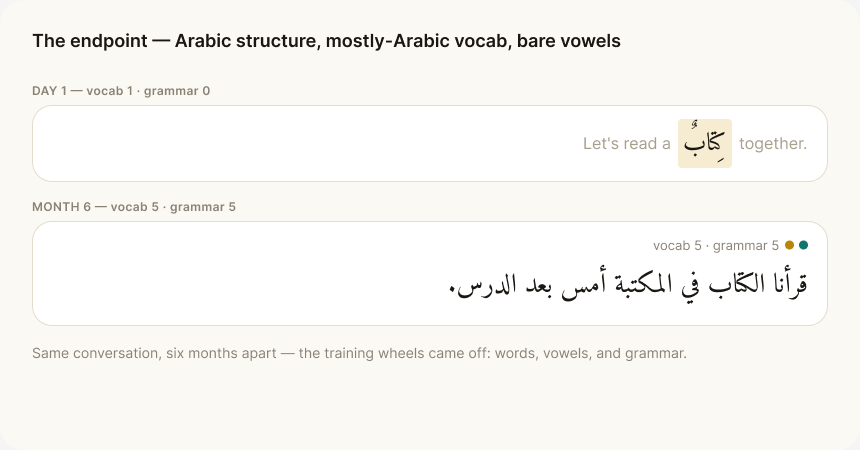
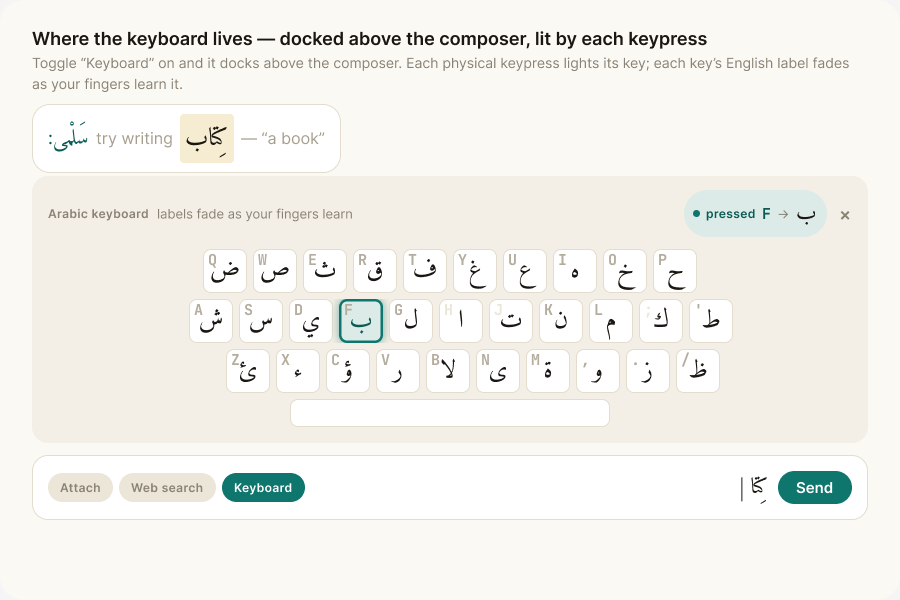

# language-agent — User Stories (v2)

> This document is the v2 user-stories backlog for **language-agent**: a capable conversational AI agent (web search + document analysis + open conversation) whose every reply is rendered in a progressive English↔Arabic blend that advances as the learner masters words. It traces directly to the brainstorm-v2 Figma screens — each screen-epic embeds its Figma frame so the stories and the design stay in lockstep. Read it top-to-bottom: the **Persona** sets who we build for, the **Story map** gives the at-a-glance shape, and then each epic (E1..E8) lists its stories with acceptance criteria. Each story is tagged with a priority (_must_ / _should_ / _could_); the _must_ stories together define the v2 MVP slice.

## Persona

**Sam** — an adult, native English speaker who currently **cannot read any Arabic at all**. Sam wants to read formal Arabic (newspapers and books, eventually fully unvocalized MSA) and is not interested in a toy drill app: Sam opens language-agent to get **real work done** — asking genuine questions, searching the web, analyzing uploaded documents — and treats the fact that every reply doubles as Arabic reading practice as the payoff. Because Sam cannot self-detect a wrong vowel (and a wrong vowel is a different word), Sam depends utterly on the product never showing incorrect Arabic. Sam is in control of pace, decodes unknown words in place, and is motivated by visible, honest progress over time.

**The operator** (secondary) — the solo developer who builds and runs language-agent and **also cannot read Arabic**. The operator appears in non-functional stories where the correctness guarantee, observability, and CI guards must hold without any human-in-the-loop who can eyeball the Arabic.

## Story map (overview)

| Epic | # stories | Must-have stories |
| --- | --- | --- |
| E1 — Agent chat with web search | 6 | Ask a real question and get a useful answer rendered in the blend · Agent runs a web search with a quiet, collapsed tool-activity strip · Control web search with an auto / always / never toggle · Trust a searched answer via inline citations and a source rail · Look up any Arabic word inline without leaving the answer · Answers stay inside my comprehension level and never show wrong Arabic |
| E2 — Document upload + grounded, cited replies | 6 | Upload a document and ask about it · See exactly which passage an answer came from · Keep the document in context across turns · Trust a doc-grounded answer I cannot read in Arabic |
| E3 — Two-axis progression control | 6 | Push the Words dial to render more (or less) Arabic vocabulary · Shift the Grammar dial toward Arabic word order independently of vocabulary · Override the AUTO placement and pick how long the hold lasts · Understand why a dial moved, and approve advances before they happen |
| E4 — Structure-swap mode | 6 | Grammar trainer (Mode A): English words in Arabic structure · Role-band coloring with redundant role labels · Reveal the mapping to natural order on demand |
| E5 — Learning path — where am I + overrides | 6 | See my placement on two honest tracks · Understand why I am here, grounded in my own data · Hold my level with a three-flavor thermostat · Never have my level silently drop · Be nudged to advance only when truly ready |
| E6 — The learning arc over time | 6 | Feel steady, motivating progress across sessions · Reach reading unvocalized Arabic (the north star) · The blend breathes down gracefully when I struggle |
| E7 — Native typing — trainer keyboard | 6 | Type Arabic via a dual-labelled on-screen trainer keyboard · Type harakat on Shift, with the bare skeleton auto-vowelled early · Blend-aware margin correction that never punishes an English fallback |
| E8 — Cross-cutting / non-functional | 7 | The verified-blend gate never shows me incorrect Arabic · Audio pronunciation matches the exact vocalized form shown · Screen-reader and keyboard access in logical order, with correct bidi · Chat feels instant on plain turns; searched turns show progress, not a hang |

## Epic 1 — Agent chat with web search   (screen: agent chat)

### US-1.1 — Ask a real question and get a useful answer rendered in the blend  ·  _must_

**As a** Sam, an adult who cannot yet read Arabic but uses the agent for real tasks, **I want** to type a genuine question (in English) and get a substantive, correct answer back in the progressive English-Arabic blend, **so that** I get real work done while every reply doubles as Arabic reading practice, instead of a toy lesson.

**Acceptance criteria:**
- Given I type a real question into the RTL composer and send, when the agent answers, then the reply is a genuinely useful answer to MY question (not a canned drill) rendered as one RTL message bubble in arabic-reading-lg.
- Given the reply renders, then the assistant prose is a blend: confirmed/high-frequency content words appear as Arabic tokens (status-tinted, vowel-faded) and the remaining scaffolding appears in english-recede grey, switching at whole-token boundaries (Amiri and Inter never mixed inside one word).
- Given the reply is for a non-searched conversational turn, then the blended tokens stream and paint the reading surface in under ~1s (the v1 hot-path budget is preserved when no tool runs).
- Given the answer is shown, then a per-reply twin-dot stamp (gold V dot + teal S dot) sits in the bubble's RTL leading corner reflecting this message's vocab and structure level.
- Given my user query and any verbatim source text, then those are NEVER re-rendered as blended Arabic — the blend applies only to the assistant's own generated prose.

### US-1.2 — Agent runs a web search with a quiet, collapsed tool-activity strip  ·  _must_

**As a** Sam, who asks the agent current-events and factual questions, **I want** the agent to search the web when my question needs fresh facts, and show that it did so in a calm collapsed strip, **so that** I can tell the answer is grounded in real sources and that a slower searched turn is making progress, not hanging.

**Acceptance criteria:**
- Given my question needs current information, when the agent decides to search, then a tool-activity strip appears immediately in the running state (spinner / quiet teal shimmer + 'searching...') above the prose, so a searched turn never looks like a hang.
- Given the search completes, then the strip collapses to a done state showing a check plus a summary like 'searched the web / N sources' (with the Arabic label per the blend), set in latin-label on surface-soft and rendered LTR (never RTL).
- Given I click/tap the collapsed strip, when it expands, then it reveals the actual query and a per-step list of what ran.
- Given a search fails or errors, then the strip shows an error state (correction-remove dot) rather than silently dropping the tool, and the agent still attempts an answer or says it could not find sources.
- Given the tool strip and the prose coexist, then all tool chrome stays in the quieter surface-soft / latin-body-sm register, collapsed by default, and stays OUT of the RTL reading surface.

### US-1.3 — Control web search with an auto / always / never toggle  ·  _must_

**As a** Sam, who sometimes wants a guaranteed-fresh answer and sometimes wants the agent to just answer from what it knows, **I want** a web-search toggle in the composer with auto, always, and never settings, **so that** I stay in control of when the agent reaches out to the web for a given turn or conversation.

**Acceptance criteria:**
- Given the composer, then there is a web-search toggle pill rendered in the scarce-teal brand treatment: muted/surface-strong when off, primary teal with a 'web' label when armed.
- Given the toggle is on AUTO (default), when I send a question, then the agent decides for itself whether to search and the tool-activity strip only appears when it actually searches.
- Given I set the toggle to ALWAYS, when I send a question, then the agent performs a web search for that turn even if it could have answered from memory.
- Given I set the toggle to NEVER, when I send a question, then the agent answers without searching and no web tool-activity strip appears.
- Given I change the toggle state, then the current state is visually unambiguous before I send, and the choice is honored for the turn I send.

### US-1.4 — Trust a searched answer via inline citations and a source rail  ·  _must_

**As a** Sam, who cannot read the Arabic answer yet but still needs to trust its provenance, **I want** inline citation markers, hover/tap source cards, and a source rail under the reply, **so that** I can verify where each claim came from and trust the answer even before I can read it.

**Acceptance criteria:**
- Given a searched/grounded reply, then claims carry an inline citation marker as a superscript gold numeral (accent-gold), rendered LTR-in-RTL and bidi-isolated, anchored to an English-scaffolding token or end-of-clause and keyed to a token ID — NEVER injected mid-Arabic-word.
- Given I hover or tap a citation marker, then a source card opens (the only floating/shadowed tier) showing favicon + title + page age, with the cited_text quote shown verbatim in its SOURCE language (italic, NOT blended into Arabic) and an 'open source' link.
- Given the reply has sources, then a source rail of numbered metadata chips (badge-pill, surface-strong) is docked under the turn, collapsed below ~3 sources with a 'see all N' expander.
- Given I cannot yet read the Arabic answer, then a gold-accented 'grounded' margin note states the provenance in plain English ('This came from {source}.') so I can trust the answer without reading it.
- Given a cited span was anglicized away during blending, then its citation re-anchors to the English fallback token or its clause — no citation is ever dropped or orphaned.

### US-1.5 — Look up any Arabic word inline without leaving the answer  ·  _must_

**As a** Sam, who hits Arabic words I do not yet know inside a useful answer, **I want** to hover an Arabic token for a quick peek and click it for a full card, **so that** I can decode the answer in place and grow my vocabulary from real content.

**Acceptance criteria:**
- Given any Arabic token in the reply, then it is individually clickable with a tap target of roughly 48px (arabic-token at 25px in a line-height-1.9 row).
- Given I hover an Arabic token, then a quick peek shows transliteration + gloss + audio playback for that word in its context.
- Given I click an Arabic token, then the full word card opens with root + pattern + word-family breakdown and an 'add to list' / 'I know this' action.
- Given I press 'I know this' on the word card, then that fires the vocab-axis advance event for that (lemma, sense): the word moves toward known, renders Arabic more readily, and sheds vowels going forward.
- Given I click a word as a soft 'I didn't know this', then the word breathes back toward learning — its vowels reappear and it may drop back to English in later replies (the vocab axis is not monotonic).
- Given audio is requested, then it plays only for a GREEN-verified token (a YELLOW/RED word never gets synthesized audio).

### US-1.6 — Answers stay inside my comprehension level and never show wrong Arabic  ·  _must_

**As a** Sam, who would be silently misled by a single wrong vowel since neither I nor the operator reads Arabic, **I want** every reply to stay above my comprehension floor and to contain only verified Arabic, **so that** I am never taught a wrong word and never hit a wall of unreadable text in the middle of real work.

**Acceptance criteria:**
- Given any assistant reply, then unknown-token share stays at or below 5% (>=95% known/covered, counting English fallbacks as covered) — a turn over the floor is regenerated rather than shown.
- Given a token fails verification (dediac round-trip fails or CAMeL membership rejects the intended sense = RED), then the learner NEVER sees it: it is withheld and replaced by a known-good cached word or an English fallback.
- Given a token is YELLOW (verifier uncertain), then it surfaces with its vowel-fade suppressed (shown full) plus a margin note, and it never receives synthesized audio.
- Given I drive both the vocab and structure dials hard at once, then the comprehension governor caps combined novelty per turn and the reply shows a soft 'stretching' state rather than crashing below the coverage floor.
- Given an English fallback token is used, then it is rendered in english-recede grey and is never marked as an error or correction (an English fallback is not a mistake).

## Epic 2 — Document upload + grounded, cited replies   (screen: doc upload)

### US-2.1 — Upload a document and ask about it  ·  _must_

**As a** Sam, an adult learner who cannot yet read Arabic but uses the agent for real work, **I want** to attach a PDF (or similar) from the composer and ask a question about its contents, **so that** I get a real, useful answer grounded in my own document instead of a generic web answer.

**Acceptance criteria:**
- Given the composer, when I tap the paperclip Attach control and pick a file, then a doc chip appears on the row above the input showing a file-type glyph, truncated filename, page count (e.g. '12 pp'), and an x to remove it
- Given a file is being parsed, when the chip shows status 'parsing', then I cannot yet ask about it and the chip visibly indicates not-ready; when parsing completes the chip flips to 'ready'
- Given a 'ready' doc chip and a typed question, when I send the turn, then the assistant answers grounded in the document and the answer prose is rendered in the verified English↔Arabic blend (RTL, clickable status-tinted vowel-faded tokens), exactly like any other reply
- Given a file that fails to parse, when ingestion errors, then the chip shows an error state and the agent tells me the doc is unavailable rather than silently answering ungrounded
- Given my uploaded document text, when the reply is composed, then the document body is never rendered into Arabic blend (only the assistant's generated prose passes through the blend; cited quotes stay verbatim)

### US-2.2 — See exactly which passage an answer came from  ·  _must_

**As a** Sam, who needs to check a claim against the source he uploaded, **I want** each doc-grounded claim to carry an inline citation I can open to the exact page and passage, **so that** I can verify where the answer came from instead of trusting an unsourced summary.

**Acceptance criteria:**
- Given a doc-grounded reply, when it renders, then a citation marker appears as a superscript gold numeral, rendered LTR-in-RTL and bidi-isolated, anchored to an English-scaffolding token or end-of-clause and never injected mid-Arabic-word
- Given a citation marker, when I hover or tap it, then a source card opens (the single floating popover tier) showing the doc title, a page reference (e.g. 'p. 5') or chunk badge, and the cited_text quote shown verbatim and italic in its source language, NOT blended into Arabic
- Given the source card, when I choose 'open in document', then a right doc drawer pushes in as an overlay (not a permanent third column) with the cited passage scrolled into view and highlighted
- Given a reply with up to ~3 doc sources, when it renders, then a source rail of numbered metadata chips sits under the turn, collapsed by default above ~3 with a 'see all N' expander
- Given the doc drawer is open, when I dismiss it, then it closes back to an overlay-free conversation stream and the cited passage highlight is cleared

### US-2.3 — Keep the document in context across turns  ·  _must_

**As a** Sam, who asks several follow-up questions about the same document, **I want** the uploaded doc to persist as conversation context after the first question, **so that** I can keep asking about it naturally without re-uploading or re-explaining each time.

**Acceptance criteria:**
- Given I uploaded a doc and asked one question, when I type a follow-up that refers to 'it' or 'the report', then the agent answers grounded in the same document without my re-attaching it
- Given the doc is active context, when I look at the composer, then the doc chip persists on the attachment row across turns and clearly reads as active context, not just a one-time upload
- Given a multi-page document, when follow-up answers cite different passages, then citations across turns resolve to stable page/chunk references for the same file (parser version pinned per file so citation indices do not drift)
- Given an active doc chip, when I tap its x to remove it, then subsequent turns are no longer grounded in that document and the agent does not cite it
- Given a follow-up that needs no document lookup, when I send it, then the non-doc turn keeps the fast hot path and does not show a stale or spurious doc citation

### US-2.4 — Trust a doc-grounded answer I cannot read in Arabic  ·  _must_

**As a** Sam, who currently cannot read any Arabic but still needs to trust the answer's provenance, **I want** a plain-English provenance note attached to a doc-grounded claim, **so that** I can trust where the answer came from even when the blended Arabic is beyond my current level.

**Acceptance criteria:**
- Given a doc-grounded reply, when it renders, then a gold-accented 'grounded' margin note appears in the per-message annotation tray reading in plain English, e.g. 'This came from {document title}, p. 5'
- Given the grounded note, when I read it, then it is in English regardless of how high the vocabulary blend is set, so a learner who can read no Arabic can still parse the provenance
- Given the grounded note anchors to a token, when I open it, then it points to the same passage as the inline citation marker for that claim (the note and marker agree)
- Given the verified-blend trust stack, when the answer is rendered, then I never see incorrect Arabic in a doc-grounded reply (only verified blend tokens are shown; an unverifiable span falls back to English rather than rendering a wrong vowel)

### US-2.5 — Watch the document being read as progress, not a hang  ·  _should_

**As a** Sam, who waits while the agent retrieves from a long document, **I want** a quiet tool-activity strip that shows the agent reading my document, **so that** a slow grounded turn reads as visible progress instead of a frozen screen.

**Acceptance criteria:**
- Given a turn that retrieves from the doc, when it starts, then a collapsed-by-default tool-activity strip shows a running state (e.g. spinner + 'reading report.pdf') in the quiet surface-soft / latin register, never RTL
- Given the retrieval finishes, when the answer is ready, then the strip shows a done state (check + 'read report.pdf') and can be expanded to show the retrieval steps
- Given a doc-grounded turn, when streaming begins, then the blended prose tokens paint first and the tool/citation chrome streams in after, so the reading surface is never blocked by tool noise
- Given retrieval fails mid-turn, when the strip updates, then it shows an error state (correction-remove dot) and the agent does not present a fabricated grounded answer
- Given prefers-reduced-motion, when the running shimmer would animate, then motion is suppressed while the state text still updates

### US-2.6 — Inspect a cited Arabic token inside the doc drawer  ·  _could_

**As a** Sam, who wants to learn from the exact words an answer was grounded in, **I want** the Arabic tokens in a doc-grounded answer to stay clickable, including where they tie to the cited passage, **so that** I can peek at meaning and pronunciation while seeing the source it came from.

**Acceptance criteria:**
- Given a doc-grounded blended reply, when I hover an Arabic token, then I get the quick peek (transliteration + gloss + audio); when I click it, then the full word card opens (root / pattern / family / add-to-list), unchanged from a normal reply
- Given the doc drawer shows the cited passage, when that passage is in the source language, then it is shown verbatim and is NOT turned into clickable blend tokens (it is source data, not a learning surface)
- Given an Arabic token that carries a citationRef, when I open its word card, then I can still reach the source for the claim it belongs to (the token's citation is discoverable from the token, keyed by stable token ID)
- Given a cited span that was anglicized away at my current vocab level, when its citation re-anchors, then the marker attaches to the English fallback token or the clause rather than disappearing

## Epic 3 — Two-axis progression control   (screen: progression)

### US-3.1 — Push the Words dial to render more (or less) Arabic vocabulary  ·  _must_

**As a** Sam, an adult who cannot yet read Arabic, **I want** to drag the Words slider on the twin-dial tray and see the agent render more (or fewer) content words in Arabic, independent of grammar, **so that** I can control how much Arabic vocabulary I'm reading without touching sentence structure, and feel the change before I commit to it.

**Acceptance criteria:**
- Given the composer-adjacent twin-dial tray is open, when I look at it, then the top track is labeled Words with the gold status-new fill and an ا/a glyph, notched from 'mostly English' (left) to 'mostly Arabic' (right) across a shared 6-notch track (V0..V5)
- Given I drag the Words dial up one notch, when I release, then the NEXT assistant reply renders as a live ghost preview behind an 'Apply' confirm showing more content words in Arabic (gold/teal status washes, vowels per fade) while the Grammar dial and structure stay unchanged
- Given the Words dial moves, when the reply renders, then every Arabic token is still verified (GREEN/YELLOW only, never RED) and bidi-isolated — the learner never sees an unverified or wrong Arabic word
- Given I drag both dials toward maximum, when the combined novelty would push predicted unknown-token share above 5%, then the dial shows a soft 'stretching' state and the generator introduces new items gradually instead of obeying literally (coverage floor unknownTokenShare ≤ 0.05 holds)
- Given the new Words level, when this reply emits, then progression.vocabStage reflects the new value and progression.vocabSource becomes 'custom'

### US-3.2 — Shift the Grammar dial toward Arabic word order independently of vocabulary  ·  _must_

**As a** Sam, who wants to read formal Arabic eventually unvocalized, **I want** to drag the Grammar slider toward 'Arabic order' on its own track so the sentence's structure migrates English→Arabic (adjective-after-noun, ال, iḍāfa, VSO) regardless of which words are Arabic, **so that** I can train Arabic syntax separately from vocabulary and even read English words arranged the Arabic way.

**Acceptance criteria:**
- Given the twin-dial tray, when I look at the bottom track, then it is labeled Grammar with the teal primary fill and a reorder-arrows icon, notched 'English order' (left) to 'Arabic order' (right) on the same 6-notch track (S0..S5)
- Given I raise the Grammar dial from S0 to S1, when the next reply renders, then the structure transform is applied (e.g. adjective moves after the noun: 'the red book' → 'the book red') while the Words dial level is unchanged
- Given the Grammar dial advances past a rung the first time, when that reply renders, then a one-shot inline structure note appears (margin kind 'structure', oneShot=true, lang en) naming the rule, and it is logged so it never repeats
- Given the Grammar dial is high while the Words dial is low, when the reply renders, then English words are shown in Arabic structure (grammar-trainer / off-diagonal) and progression.renderMode reflects the swap — proving the two axes are decoupled
- Given case/mood endings (iʿrāb, S5), when both the structure rung and the vowel fade act on the final vowel, then they share one track so the two axes never fight over that final vowel
- Given the Grammar move, when the reply emits, then progression.structureStage updates and progression.structureSource becomes 'custom'

### US-3.3 — Control vowel density with the Full / Minimal / Off slider  ·  _should_

**As a** Sam, who is building toward reading unvocalized text, **I want** a third, finer Full · Minimal · Off vowel control in the same dial tray, on top of the automatic per-word fade, **so that** I can deliberately read with fewer ḥarakāt as I gain confidence, working toward bare unvocalized MSA.

**Acceptance criteria:**
- Given the dial tray, when I open it, then a third control renders the v1 vowel-slider geometry with three segments Full · Minimal · Off, the selected segment in primary teal
- Given I select 'Minimal', when the next reply renders, then ḥarakāt are reduced by subtraction from the same single verified form — only the short vowels come off, never the consonant skeleton or long-vowel letters
- Given I select 'Off', when a brand-new (status 'new') word still appears in Arabic, then that word's full ḥarakāt are preserved as a safety floor (the per-word automatic fade still protects unmastered words from going bare)
- Given any vowel setting, when text renders, then it is verified Arabic — a stripped vowel never changes the word into a different (wrong) word
- Given I change the vowel slider, when the setting takes effect, then it is independent of the Words and Grammar dials (it does not move vocabStage or structureStage)

### US-3.4 — Read the 2-D 'you are here' path map and see off-diagonal positions as legal  ·  _should_

**As a** Sam, who models progress as one line until shown otherwise, **I want** a small 2-D path map (vocab on x, structure on y) showing a single dot for where I am, the auto-path diagonal, and the four named modes at the corners, **so that** I can literally see that vocabulary and grammar are two separate axes and that being ahead on one is allowed.

**Acceptance criteria:**
- Given the dial panel, when I view the inset map (~120×120px, hover-expand), then it shows warm-paper canvas, a hairline grid, x=vocab and y=structure, a single warm-gold dot at my current (vocabStage, structureStage), and a ghosted diagonal for the auto-path
- Given the four corners, when I read the labels, then they name the four modes (start / vocab trainer / grammar trainer / full Arabic) and faint gridlines mark the named stages
- Given my position is off the diagonal (e.g. high vocab, low structure), when I view the map, then the dot sits visibly off-diagonal and is shown as a legal position, not flagged as an error
- Given I tap a cell on the map, when the preview opens, then it shows 'what a reply looks like here' using the existing token tints and vowel fade for that (vocab, structure) pair
- Given the placement confidence is low (cold-start, few signals), when I view the dot, then it renders as a fuzzy/low-confidence dot rather than a precise one

### US-3.5 — Override the AUTO placement and pick how long the hold lasts  ·  _must_

**As a** Sam, who sometimes wants to go faster or slower than the service decides, **I want** to drag a dial away from its AUTO tick and choose whether my override holds for this chat, until I resume, or becomes my durable pace, **so that** I stay in control of my pace without the agent silently overriding me or lurching the conversation.

**Acceptance criteria:**
- Given AUTO is active, when I view each track, then a faint vertical 'auto' tick marks where the learning-path service would set that dial
- Given I drag a dial away from its auto tick, when I release, then a small 'custom' override pill appears on that track and an AUTO·HOLD segmented toggle flips to HOLD
- Given I am in HOLD, when the hold sub-row appears, then I can pick exactly one of three flavors — 'This chat' (session, reverts when the conversation ends), 'Until I resume' (sticky, shown as a persistent banner), 'Make this my pace' (a durable offset AUTO respects going forward) — plus a 'Resume auto' text button in primary teal
- Given I chose 'Make this my pace', when AUTO later recomputes, then it still moves but biases around my offset, and the override value is stored per axis (override resolves as override ?? computed)
- Given AUTO is re-enabled or recomputes, when a session ends, then the dials never move more than ≤1 frequency band and ≤1 grammar rung per session (capped slew, so the chat never lurches)
- Given the reply emits under a hold, when I inspect it, then progression.vocabSource / structureSource reads 'custom' or 'hold' accordingly

### US-3.6 — Understand why a dial moved, and approve advances before they happen  ·  _must_

**As a** Sam, who would lose trust if the agent suddenly spoke more or less Arabic with no reason, **I want** the per-reply twin-dot stamp plus an announced, dismissible margin nudge that explains every dial change and asks before crossing a level I held, **so that** I always know why the blend shifted and never feel the agent changed my pace behind my back.

**Acceptance criteria:**
- Given any assistant reply, when it renders, then a twin-dot stamp sits in the bubble's leading corner (RTL: top-right) — a gold dot filled to this message's vocab level and a teal dot filled to its structure level — tooltipped like 'vocab 3 · grammar 2'
- Given AUTO is about to cross a dial I previously held, when it would advance, then it asks first in the margin (margin-note-encourage, teal wash) — e.g. 'You've confirmed 12 words and nailed agreement 5× — ready to let more render in Arabic? [Advance] [Not yet]' — animated, dismissible, and never blocking the chat
- Given a dial moved on its own, when I open the reply's 'why it moved' disclosure, then progression.movedReason gives the cause (e.g. 'advanced-vocab', 'breathed-down:error-spike') grounded in the same word-list/FSRS data the chat already uses
- Given I tap a track for its per-axis 'why am I here' card, when it opens, then it cites real counts — vocab: 'X words confirmed · Y% of everyday text covered · Z due' and structure: 'iḍāfa: 5/8 correct uses — 3 more to unlock VSO' — with no parallel progress store
- Given forgetting (FSRS R decay) would lower a dial, when it surfaces, then it appears as a gentle 'let's re-warm these' rather than a silent or punishing reversal — mastery never silently lowers a dial
- Given I clicked an Arabic word (a soft 'I didn't know this'), when the placement recomputes, then that word breathes back toward 'learning' and can pull the vocab signal down as a negative signal

## Epic 4 — Structure-swap mode   (screen: structure swap)

### US-4.1 — Grammar trainer (Mode A): English words in Arabic structure  ·  _must_

**As a** Sam, a native English speaker who can't read Arabic yet, **I want** an optional mode that renders a reply using English words I already know but arranged in Arabic structure (verb-first, adjective after the noun, iḍāfa for possession), **so that** I can learn Arabic sentence structure with zero vocabulary load, before I can read the script.

**Acceptance criteria:**
- Given Mode A is active for a reply, when the assistant renders 'The new teacher read the student's book', then it shows a single surface line in Arabic order (e.g. 'read the·teacher the·new book the·student') — never two parallel sentences.
- Given the reply is in Mode A, when the bubble renders, then it uses direction:rtl, each English token is bidi-isolated (U+2066–2069 / <bdi>) so Latin words don't scramble, and a leading ⟸ direction glyph with accessible label 'reads right-to-left — Arabic order' is shown.
- Given Arabic-structure definiteness/agreement applies to an English word, when it renders, then the article/agreement appears as an annotation chip on the English word (a DEF chip or agreement tie) — never as letters glued to the English stem (no fabricated 'al-teacher').
- Given any reply in Mode A, when it is generated, then English tokens are NOT routed through the Arabic verification stack (CAMeL membership) and instead a grammaticality judge validates the Arabic structure.
- Given a screen reader reads a Mode A bubble, when it traverses the content, then the exposed accessible text is the natural/spoken (logical) order, never the scrambled visual order.

### US-4.2 — Role-band coloring with redundant role labels  ·  _must_

**As a** Sam learning Arabic structure, **I want** each constituent in a swapped sentence tinted by its grammatical role with a small redundant label, **so that** I can see at a glance which word is the verb, adjective, or possessive construct without decoding the grammar myself.

**Acceptance criteria:**
- Given a reply in swap mode, when constituents render, then verb = teal wash (status-learning-bg #dcebe8), adjective = gold wash (status-new-bg #f6ecd2), and a plain noun phrase carries no wash (the default) — reusing existing status washes so zero new colors are added.
- Given an iḍāfa/construct in the sentence, when it renders, then a hairline bracket in accent-gold #b8860b spans the possessed+possessor pair, and a definiteness ال clitic carries a thin teal underline.
- Given role is conveyed by a wash, when a constituent is shown, then a redundant tiny role label (V, ADJ, DEF) is also present so role never relies on color alone (WCAG 1.4.1).
- Given a single reply, when the agent foregrounds a target structure, then exactly one structure per turn is spotlighted by the color-bands (this turn VSO; next turn iḍāfa) rather than tinting every constituent.

### US-4.3 — Reveal the mapping to natural order on demand  ·  _must_

**As a** Sam reading a swapped sentence, **I want** to toggle 'show natural order' and tap any constituent for an interlinear gloss, **so that** I can check the transformation between Arabic order and my native order whenever I'm unsure, without it cluttering the read by default.

**Acceptance criteria:**
- Given a swapped reply, when I toggle 'show natural order', then thin muted (#8a8275) curved reorder arrows connect each swapped word to its position in the other language's order, animating once (250ms draw) then resting as static guides.
- Given prefers-reduced-motion is set, when I toggle 'show natural order', then the reorder arrows appear without the draw animation.
- Given a constituent in a swapped reply, when I tap it, then a compact 2-line interlinear (IGT) expands beneath that constituent only: line 1 surface form, line 2 word-aligned natural-order gloss plus one role chip (e.g. VSO, iḍāfa, adj·agr·f.sg.def).
- Given the interlinear is expanded, when it renders, then it is scoped to the single tapped phrase on the warm-paper card surface — not a full wall of glosses for the whole sentence.

### US-4.4 — Vocab trainer (Mode B): Arabic words in English structure  ·  _should_

**As a** Sam who wants to meet new Arabic vocabulary without the grammar tax, **I want** an optional mode that slots Arabic content words into familiar English word order, for recognition only, **so that** I can build vocabulary in a sentence shape I already understand without simultaneously fighting Arabic grammar.

**Acceptance criteria:**
- Given Mode B is active, when a reply renders, then Arabic content words appear in English (familiar) word order, each Arabic token bidi-isolated inside an LTR (direction:ltr) flow with a leading ⟹ glyph and accessible label 'reads left-to-right — English order'.
- Given Mode B is recognition-only, when I am in this mode, then I cannot produce/compose in Mode B (production is disabled) so I never fossilize English word order onto Arabic.
- Given an Arabic token in Mode B, when I hover it, then the quick peek (transliteration + gloss + audio) appears, and when I click it the full word card (root/pattern/family/add-to-list) opens — clickable-word behavior is preserved in swap mode.
- Given Mode B duplicates v1's vocab blend in familiar order, when the learning-path presets are applied, then Mode B is reachable as the 'vocab trainer' preset (vocab high, structure low) and is treated as lower-priority/secondary to Mode A.

### US-4.5 — Focus on one grammar rule at a time via presets  ·  _should_

**As a** Sam who can be overwhelmed by too much new structure at once, **I want** swap mode to foreground a single target structure and let me pick a 'grammar trainer' preset that pins structure high while holding vocab low, **so that** I can drill one Arabic rule (e.g. iḍāfa, or VSO) at a time instead of decoding a fully rearranged gibberish sentence.

**Acceptance criteria:**
- Given I choose the 'grammar trainer' preset, when it applies, then the structure dial pins high and the vocabulary dial holds low (Mode A), and the renderMode in the message is 'grammar-trainer'.
- Given a reply foregrounds one structure, when a new rule first appears, then a one-shot inline structure note explains it (e.g. 'Arabic puts the verb first — Verb-Subject-Object') and is logged so it never repeats.
- Given a single turn, when the agent mirrors structure, then only one target structure is reordered/spotlighted that turn (mirror-one-structure-per-turn), so the sentence stays legible rather than fully scrambled.
- Given the structure-swap presets, when they are derived, then they fall out for free from the two axes (grammar trainer = pin structure, hold vocab; vocab trainer = inverse) with no separate mode system, and a manual override flips the 'custom' pill on the affected dial.

### US-4.6 — Conservative case marking and trustworthy structure in swap mode  ·  _could_

**As a** Sam, who cannot tell a correct Arabic ending from a wrong one, **I want** swap mode to mark case endings conservatively and never show me incorrect Arabic structure, **so that** I trust that every grammar pattern I'm being taught is correct, even though neither I nor the operator can read Arabic to catch an error.

**Acceptance criteria:**
- Given a swapped reply early in the structure ladder, when case endings (iʿrāb) would apply, then GEN is shown inside an iḍāfa (structurally load-bearing) while full case marking is suppressed early.
- Given Mode A produces no Arabic words to diacritize, when the turn is generated, then it bypasses the Arabic verification stack but a grammaticality judge must pass on the Arabic structure before the reply is shown (the learner never sees an unverified structure).
- Given a message in swap mode, when it is serialized, then per-token role, surfaceOrder, and structureStage fields are populated and the renderMode is 'grammar-trainer' or 'vocab-trainer', consistent with the active dials.
- Given a structure note is shown for a rule, when the same rule recurs in later turns, then the note is suppressed (oneShot logged) so training wheels fade rather than nag.

## Epic 5 — Learning path — where am I + overrides   (screen: learning path)

### US-5.1 — See my placement on two honest tracks  ·  _must_

**As a** Sam, an adult who currently cannot read any Arabic, **I want** to open a progress panel showing my position on two stacked tracks — a vocabulary coverage bar with CEFR ticks and a segmented grammar-rung ladder, **so that** I can see where I actually am on both the words I know and the grammar I have mastered, instead of guessing from a single fused number.

**Acceptance criteria:**
- Given I open the progress panel, when it renders, then I see exactly two stacked horizontal tracks: top = Vocabulary (manuscript-gold #b8860b frequency-coverage bar with a 'you are here' knob and faint A1/A2/B1 CEFR-band ticks), bottom = Structure (teal #0f766e, segmented into the five named rungs definiteness · agreement · iḍāfa · VSO · case)
- Given the Structure track, when I look at the rungs, then filled/cleared rungs render solid, the current rung pulses, and locked rungs render as a hairline only — and the rung order is exactly definiteness → agreement → iḍāfa → VSO → case
- Given the panel is a recontextualized margin (not a separate page), when it is open, then it sits in the collapsible progress panel and the chat stream behind it stays visible and usable
- Given the panel uses brand color, when rendered, then teal appears only on the Structure track and its controls (scarce-teal honored) and gold only on the Vocabulary track — no third brand color is introduced
- Given the whole panel, when laid out on warm paper, then it renders RTL-first consistent with the stream and every numeral that appears uses the design-system numeral rule
- Given the two tracks, when displayed together, then they map 1:1 to the message's progression.vocabStage and progression.structureStage (0..5) — the same values that drive the per-reply twin-dot stamp

### US-5.2 — Understand why I am here, grounded in my own data  ·  _must_

**As a** Sam, who can't read the Arabic and needs to trust the placement, **I want** to tap either track and see a plain-English 'why am I here' card built from my real word-list and FSRS numbers, **so that** I trust that my level reflects what I have actually confirmed and produced, not a black-box guess.

**Acceptance criteria:**
- Given I tap the Vocabulary track, when the disclosure card opens, then it states concrete counts from the existing word_state/FSRS store, e.g. '742 words confirmed · 87% of everyday text covered · 38 due for review' — not synthetic or parallel-store numbers
- Given I tap the Structure track, when the card opens, then it explains the current rung in production terms, e.g. 'iḍāfa: 5/8 correct uses — 3 more to unlock VSO', making clear a rung advances only via correct production, not by reading it
- Given the disclosure is a read-view, when it shows any figure, then that figure traces to the same per-(user, lemma, sense) primitive the chat already uses (no separate progress store is queried)
- Given low-confidence placement (cold start, few signals), when the card renders, then it honestly communicates low confidence (a fuzzy/uncertain 'you are here' indicator rather than a falsely precise one) and explains it falls back to a CEFR/frequency prior
- Given the card is open, when I read it, then all body copy is plain English on warm paper and dismissing it returns me to the chat with no level change

### US-5.3 — Hold my level with a three-flavor thermostat  ·  _must_

**As a** Sam, who sometimes wants the level to stop moving while I consolidate, **I want** an AUTO/HOLD thermostat that lets me pin the dials with three scopes — this chat, until I resume, or make this my pace, **so that** I can pause advancement at a comfortable level without losing it, and choose how long the pause lasts.

**Acceptance criteria:**
- Given the progress panel, when I view the thermostat, then I see an AUTO · HOLD segmented toggle (reusing vowel-slider geometry) and, when HOLD is active, a sub-row of three hold-flavor pills plus a 'Resume auto' text button in primary teal
- Given I pick 'This chat', when the current conversation ends, then the hold reverts and AUTO resumes (session-scoped)
- Given I pick 'Until I resume', when I move between sessions, then the hold persists and a persistent banner shows the level is held until I tap Resume auto
- Given I pick 'Make this my pace', when AUTO later recomputes, then AUTO still moves but around my durable offset/bias rather than ignoring it
- Given any hold is active, when placement recomputes off the hot path, then the held dial value is what the chat reads (override is resolved as override ?? computed) and the held reply renders at the held vocab/structure stage
- Given a hold is set, when it takes effect, then progression.vocabSource/structureSource reflect 'custom' or 'hold' (not 'auto') so the per-reply stamp and dials stay truthful

### US-5.4 — Never have my level silently drop  ·  _must_

**As a** Sam, who would lose trust if the agent quietly started speaking more English to me, **I want** every downward or re-asserting change to be announced and reversible, and forgetting to surface gently rather than as a punishment, **so that** I am never confused by an unexplained regression and never feel demoted.

**Acceptance criteria:**
- Given mastery would lower a dial, when the system evaluates a downward move, then it MUST NOT silently drop the dial — any reduction is announced in the margin before it changes what renders
- Given AUTO is about to cross a dial I previously held, when it wants to re-assert, then it asks in the margin via a re-assertion nudge (margin-note-encourage teal wash #dcebe8), animated and dismissible, never blocking the chat, e.g. 'You've confirmed 12 words and nailed agreement 5× — ready to let more render in Arabic? [Advance] [Not yet]'
- Given forgetting (FSRS R decay) is detected, when it surfaces, then it appears as a gentle 're-warm these' prompt rather than a reversal that demotes my track position
- Given AUTO is moving on its own, when it nudges a dial, then movement is capped at ≤ 1 frequency band and ≤ 1 grammar rung per session so the chat never lurches, and progression.movedReason records the cause (e.g. 'advanced-vocab', 'breathed-down:error-spike')
- Given any announced change, when I tap 'Not yet' / dismiss, then the prior level is retained and no reply silently re-renders at a different stage

### US-5.5 — Be nudged to advance only when truly ready  ·  _must_

**As a** Sam, who wants to progress but only when the evidence supports it, **I want** advance nudges that fire on genuine mastery signals and respect the comprehension floor, **so that** I move up exactly when I'm ready and never get pushed past what I can comprehend.

**Acceptance criteria:**
- Given I tap [Advance] on a re-assertion nudge, when it applies, then the targeted dial moves up by at most one band/rung and the next assistant reply renders at the new stage
- Given the vocab axis, when placement proposes a rise, then it rises only while predicted unknown-token share stays within the coverage cliff (≤ 2–5% / ≥95% coverage floor) — it will not advance into incomprehension
- Given the structure axis, when a rung is proposed as ready to unlock, then the unlock is justified by correct production of that rule (corrector-confirmed iḍāfa/agreement/VSO), not by passive reading
- Given I push both dials hard at once, when the governor evaluates the turn, then combined novelty is capped and the reply shows a soft 'stretching' state (progression.governor = 'stretching') rather than obeying both literally and crashing coverage
- Given signal trust ranking, when placement weights my evidence, then correct unprompted production outranks an explicit 'I know this', which outranks FSRS R≥0.9 on a due word, which outranks passive reads, and a word-click counts as a negative 'didn't know this' signal
- Given a nudge would fire, when the underlying signals do not meet threshold, then no nudge appears (advancement is opt-in on real readiness, never time-based pestering)

### US-5.6 — Preview an override as a live ghost before applying  ·  _should_

**As a** Sam, who wants to feel what 'more Arabic' means before committing, **I want** dragging a dial to re-render the next reply as a live ghost preview behind an Apply confirm, with off-diagonal positions shown as legal on a 2-D mini-map, **so that** I can feel the change concretely and understand that vocabulary and grammar move independently.

**Acceptance criteria:**
- Given I drag the Words or Grammar dial, when I hold before confirming, then the next assistant reply re-renders live as a ghost preview using the existing token tints + vowel fade, behind an 'Apply' confirm — nothing commits until I press Apply
- Given I drag a dial away from its auto position, when I release, then a 'custom' pill appears on that track (the override marker) distinct from the faint vertical 'auto' tick showing where the path service would set it
- Given the 2-D 'you are here' mini-map, when I open it, then off-diagonal positions (Arabic-heavy words with English order, or English words in Arabic order) render as visibly legal — the one place the two-axis decoupling is shown literally
- Given I preview 'more Arabic' vs 'more Arabic grammar', when the ghost renders, then the two changes are visibly distinct (more tokens flip to Arabic vs. word order/agreement shifts), confirming the dials are decoupled
- Given I cancel instead of Apply, when I dismiss the preview, then the committed reply and my current dial values are unchanged
- Given I press Apply, when the override commits, then it is stored as the override value for that axis (computed value preserved separately) and the twin-dot stamp/tracks update to match

## Epic 6 — The learning arc over time   (screen: endpoint)

### US-6.1 — Feel steady, motivating progress across sessions  ·  _must_

**As a** Sam, an adult native English speaker learning to read Arabic while using the agent for real work, **I want** the blend to advance visibly but gently as I confirm words and produce correct grammar, so each session shows me a little more Arabic than the last, **so that** I stay motivated by a sense of forward motion without the chat ever lurching into text I cannot read.

**Acceptance criteria:**
- Given I confirmed N words and cleared a grammar rung last session, when I return, then AUTO has nudged at most +1 vocabulary frequency band AND at most +1 structure rung (the capped slew rate), never more in one session
- Given AUTO is about to cross a dial level I previously held back at, when the new session starts, then a re-assertion margin note appears (e.g. 'You confirmed 12 words and nailed agreement 5x - ready to let more render in Arabic? [Advance] [Not yet]') that is dismissible and never blocks the chat
- Given any assistant reply, when it renders, then the twin-dot state stamp (gold vocab dot + teal structure dot) shows this message's V and S levels and its tooltip reads e.g. 'vocab 3 - grammar 2'
- Given a dial advances, when the next reply renders, then predicted unknown-token share stays <= 0.05 (the 95% coverage floor) and the governor field is 'ok' rather than letting two novelties stack
- Given mastery accrues over time, then a dial is NEVER silently lowered by the system; only the user or an announced 'let's re-warm these' decay prompt changes it downward

### US-6.2 — Reach reading unvocalized Arabic (the north star)  ·  _must_

**As a** Sam, who eventually wants to read newspapers and books in unvocalized formal Arabic, **I want** the short vowels to fade per word from full to minimal to bare as I master each word, so that mastered text reads with no harakat at all, **so that** I gradually build the ability to read normal unvocalized MSA, which is the whole reason I am here.

**Acceptance criteria:**
- Given a brand-new Arabic word (status 'new'), when it renders, then it carries FULL harakat with the gold new-word wash; as it moves to 'learning' it carries MINIMAL harakat with the teal wash; as it reaches 'known' it renders with BARE vowels, plain ink, no wash
- Given vowels fade, when any word loses harakat, then only the short-vowel marks are stripped - the consonant skeleton and long-vowel letters are NEVER removed (a faded word is still the same correct word)
- Given case/mood endings (i'rab), when they fade, then they drop first/pausal as the shared 'last wall' so the vocabulary fade and the S5 structure rung never fight over the final vowel
- Given a late-stage reply with mostly-known vocabulary at high structure, when it renders, then the visible text is mostly Arabic words in Arabic structure with mostly-bare vowels - i.e. it approximates unvocalized MSA
- Given a bare (vowel-faded) word, when I hover or click it, then the full vocalized form, transliteration, gloss and audio are still available on demand via the word card
- Given the verified-blend guarantee, when any faded form is shown, then it is produced by subtraction from one verified Arabic form so I never see an incorrect vowel or a wrong word

### US-6.3 — The blend breathes down gracefully when I struggle  ·  _must_

**As a** Sam, who sometimes hits a word or grammar pattern I have forgotten or never really learned, **I want** the blend to ease back toward more English, more vowels, or simpler structure when I signal I am lost - without it feeling like punishment or failure, **so that** I can recover comprehension in the moment and trust the agent to meet me where I am instead of stranding me.

**Acceptance criteria:**
- Given I click a word (a soft 'I didn't know this'), when the click is registered, then that word breathes back toward 'learning' - its vowels re-appear and it may drop back to English - and the vocab axis is treated as non-monotonic, not a failure event
- Given an error spike or repeated struggle this turn, when the governor reacts, then the blend eases back and the reply's 'movedReason' is recorded as 'breathed-down:error-spike' rather than silently dropping the dial
- Given forgetting surfaces from FSRS decay, when the system responds, then it shows a gentle 're-warm' framing (warm/encouraging, status-learning wash) and NEVER a punishing reversal or red error state
- Given the blend breathes down, when copy is shown, then no language frames it as failure, wrong, or a setback; the tone matches the warm-paper calm design
- Given I am maxing both dials beyond what coverage allows, when the reply renders, then the dial shows a soft 'stretching' state (governor='stretching') instead of obeying literally and crashing comprehension

### US-6.4 — See how far I have come (before / after)  ·  _should_

**As a** Sam, who wants tangible proof that months of use have changed what I can read, **I want** a before/after view that contrasts an early all-English-with-full-vowels reply against a recent mostly-Arabic, mostly-bare-vowel reply, **so that** I can see my own progress concretely and feel rewarded for sticking with it.

**Acceptance criteria:**
- Given I open the progress panel's journey view, when I request a before/after, then it renders an early-session reply (English-heavy, full harakat, English structure) beside a recent reply (mostly Arabic, mostly bare, Arabic structure) using the real rendered tokens, not a mockup
- Given the before/after is shown, when I read it, then a plain-English summary anchors the gain in real data (e.g. '742 words confirmed - 87% of everyday text covered' and 'i'dafa: 5/8 correct uses')
- Given the comparison, when I view it, then both the vocabulary axis change and the structure axis change are shown separately so I can see the two dials advanced independently
- Given any Arabic in the before/after, when I hover or click a token, then the word card still works (transliteration, gloss, audio, root/pattern) exactly as in live chat
- Given all 'how far I've come' claims, when they render, then they read from the existing word-list/FSRS primitive (no parallel progress store) so the numbers match the rest of the app

### US-6.5 — Orient myself on the two-axis journey  ·  _should_

**As a** Sam, who can be confused about why a reply is more Arabic in words but still English in word order, **I want** a 'you are here' view (dual-axis tracks plus the 2-D path map) that shows my position on vocabulary and structure and the path ahead to full Arabic, **so that** I understand that vocabulary and structure are decoupled and can trust where the agent is taking me.

**Acceptance criteria:**
- Given the progress panel, when it opens, then it shows two stacked tracks: a gold Vocabulary frequency-coverage bar with a 'you are here' knob and CEFR ticks, and a teal Structure bar segmented into the named rungs (definiteness, agreement, i'dafa, VSO, case) with filled rungs solid, current rung pulsing, locked rungs hairline
- Given the 2-D path map, when I view it, then a single warm-gold dot marks my current (vocab, structure) position, a ghosted diagonal shows the auto-path, and off-diagonal positions are visibly legal (the one place decoupling is shown literally)
- Given I tap a cell or stage on the map, when the preview loads, then it shows what an assistant reply would look like at that position using the real token tints and vowel fade
- Given I tap a track to ask 'why am I here', when the disclosure opens, then it is grounded in the same word-list/FSRS data (e.g. 'i'dafa: 5/8 correct uses - 3 more to unlock VSO')
- Given the structure axis, when I inspect progress, then it advances only on correct production (the corrector confirming I produced grammatical i'dafa/agreement), and reading a structure alone does not advance the rung

### US-6.6 — Hold my own pace against AUTO  ·  _should_

**As a** Sam, who sometimes wants the blend to stop advancing for a while without abandoning automatic progression, **I want** a thermostat-style AUTO/HOLD control with humane, announced overrides so I can pause or bias the pace and resume AUTO later, **so that** I stay in control of the difficulty without losing the benefit of the learning-path service deciding for me.

**Acceptance criteria:**
- Given the progress panel, when I view the pace control, then an AUTO/HOLD segmented toggle is shown, and entering HOLD offers three flavors: 'This chat' (reverts at session end), 'Until I resume' (sticky, persistent banner), and 'Make this my pace' (durable offset AUTO respects)
- Given I am in a sticky HOLD, when I am in any session, then a persistent banner shows the hold is active and a 'Resume auto' text button in primary teal returns me to AUTO
- Given AUTO is about to cross a dial I previously held, when it would advance, then it asks me first in the margin and never re-asserts silently
- Given I drag a dial to preview a different level, when I drag, then the next assistant reply re-renders live as a ghost preview behind an 'Apply' confirm so 'more Arabic' / 'more Arabic grammar' is felt before I commit
- Given I drag a dial away from the faint 'auto' tick, when I release, then a small 'custom' override pill appears marking the dial as manually set
- Given 'Make this my pace' is set, when AUTO recomputes later, then AUTO still moves but around my bias rather than ignoring or fighting my preference

## Epic 7 — Native typing — trainer keyboard   (screen: keyboard)

### US-7.1 — Type Arabic via a dual-labelled on-screen trainer keyboard  ·  _must_

**As a** Sam, an adult English speaker who cannot read or type any Arabic, **I want** an on-screen trainer keyboard that lays out the standard Arabic-101 keyboard and labels every key with both its QWERTY letter and the Arabic letter it produces, **so that** I can write back to the agent in Arabic without knowing the layout, while building the real, transferable muscle memory of where each Arabic letter lives.

**Acceptance criteria:**
- Given the trainer-keyboard toggle is armed on the RTL composer, when the keyboard opens, then it renders the full standard Arabic-101 layout (QWERTY-keyed) with every alphabetic key dual-labelled: the Arabic glyph in arabic-token/ink as the primary face and the small QWERTY hint in key-cap/muted-soft
- When I tap an on-screen key or press the corresponding physical key, then the Arabic letter that the Arabic-101 spec maps to that key is inserted into the compose-bar at the caret, in logical-character order (never a glyph-indexed insert)
- Given the composer is direction:rtl, when I type a sequence of letters, then each inserted Arabic letter takes its correct contextual form (isolated/initial/medial/final) and the text grows right-to-left as a single bidi-isolated run
- Given the official Arabic-101 spec is the source of truth, when the QWERTY→Arabic map is built, then a build-time check verifies every key and Shift position against that spec and fails the build on any mismatch
- When I close the keyboard toggle, then the composer remains usable and any already-typed Arabic is preserved unchanged

### US-7.2 — Keyboard labels fade per key as muscle memory builds  ·  _should_

**As a** Sam, who is gradually memorising where each Arabic letter sits on the keyboard, **I want** each key's QWERTY hint label to fade independently as I type that key correctly, so the crutch disappears only for the keys I have actually learned, **so that** I am weaned onto a real unlabelled Arabic keyboard one key at a time without losing the hint on keys I still don't know.

**Acceptance criteria:**
- Given label fade is driven by the separate per-(user, qwerty_key) typing-mastery counter (NOT word_state), when I press a key correctly, then that key's correct_keystrokes increments and only that key's hint label lerps one step toward invisible (toward surface-card)
- Given two keys with different mastery, when the keyboard is shown, then a high-mastery key shows a faint/absent hint while a low-mastery key still shows a clear key-cap hint — fade is per-key, never global
- Given the third fading scaffold is orthogonal to vocabulary, when a word's status changes (blend/vowel fade), then no key's label fade changes, and vice versa
- When a key has been mistyped repeatedly (error_count rising), then its hint label stays visible longer / re-darkens rather than fading, keeping help where I struggle
- Given prefers-reduced-motion or a manual reset, when I ask to restore labels, then all key hints return to full opacity without resetting the underlying typing-mastery counts

### US-7.3 — Live keypress highlighting during typing  ·  _should_

**As a** Sam, learning the spatial layout of the Arabic keyboard, **I want** the on-screen key I press (physical or tapped) to light up in real time, **so that** I get immediate visual confirmation of which Arabic letter I just produced and reinforce the QWERTY→Arabic mapping by sight.

**Acceptance criteria:**
- Given the trainer keyboard is open, when I press a physical key that maps to an Arabic letter, then the matching on-screen key switches to the trainer-key-active state (status-learning-bg wash, primary-active text) for the duration of the press
- When I release the key, then it returns to the resting trainer-key state with no residual highlight
- Given I hold Shift, when I look at the keyboard, then the keys re-label to show their harakat faces (US-7.4) and highlighting still tracks the pressed key in that Shifted state
- Given prefers-reduced-motion is set, when keys highlight, then the active state is an instant tint swap with no animated transition
- When I tap a key with a pointer/touch instead of typing, then the same active-highlight feedback fires so on-screen and physical input are visually consistent

### US-7.4 — Type harakat on Shift, with the bare skeleton auto-vowelled early  ·  _must_

**As a** Sam, a from-zero beginner who cannot yet supply Arabic short vowels, **I want** to type just the bare consonant skeleton and have the agent auto-vowel and verify it for me early on, with harakat available on Shift once I'm ready, **so that** I can write real Arabic before I've learned vocalization, and only take on supplying vowels myself when I choose.

**Acceptance criteria:**
- Given harakat-on-Shift is active, when I hold Shift, then the keyboard exposes the ḥarakāt (fatḥa/kasra/ḍamma/sukūn/tanwīn/shadda) on their Arabic-101 Shift positions, and pressing one inserts that combining mark on the preceding letter
- Given I am in the early auto-vowel mode, when I submit a bare consonant skeleton with no harakat, then the agent diacritizes the skeleton to the intended sense and runs the full verification pass (dediac round-trip + CAMeL membership) before any scoring or display
- Given the verified-blend guarantee, when auto-vowelling resolves the skeleton, then I am NEVER shown an incorrect Arabic vocalization — if the diacritization cannot be verified GREEN, it is flagged rather than rendered as if correct
- Given I have advanced past auto-vowel, when I type, then I am expected to supply harakat via Shift myself and the auto-voweller no longer fills them in silently
- When the skeleton I typed is ambiguous between senses, then the agent uses my conversational intent to pick the sense and the resulting full form round-trips back to exactly the skeleton I typed (no consonants added or dropped)

### US-7.5 — Blend-aware margin correction that never punishes an English fallback  ·  _must_

**As a** Sam, who mixes typed Arabic with English words I don't yet know, **I want** a gentle correction of my writing rendered in the margin tray, aware of my current blend level and treating an English fallback as legitimate, **so that** I'm corrected and encouraged without being scolded inline or marked wrong for falling back to English on a word I haven't learned.

**Acceptance criteria:**
- Given I submit a learner turn, when corrections are produced, then they render only in the per-message margin/annotation tray (margin-note-correction), never inline in the conversation spine and never interrupting it
- Given the diff semantics, when a fix is shown, then removed text uses correction-remove terracotta and the proposed text uses correction-add sage — warm, text-color-only, never fire-engine red
- Given the correction is blend-aware, when I used an English word for a token still below my vocab level, then that English fallback is treated as KNOWN/covered and is NOT flagged as an error
- Given both my text and the proposed correction must be safe, when the corrector runs, then both pass through the same verification pass so the suggested Arabic is itself verified GREEN before I ever see it
- Given a correct unprompted Arabic use in my writing, when scored, then it counts as the strongest mastery-promotion signal for that (lemma, sense) and may advance that word's blend/vowel state
- When my Arabic is already correct, then no correction is shown (the corrector does not 'correct' already-correct Arabic and confuse me)

### US-7.6 — Keyboard and corrections stay RTL/bidi-correct and operator-verifiable  ·  _could_

**As a** the operator (solo developer) who cannot read Arabic, **I want** the trainer keyboard input and margin corrections to be provably bidi-correct and guarded by automated checks, **so that** a wrong contextual form, scrambled numeral, or stripped letter can't ship silently when no human in the loop reads Arabic.

**Acceptance criteria:**
- Given every typed token is wrapped in a Unicode bidi isolate (U+2066–2069), when Arabic and any Latin/English fallback appear in one learner turn, then neither run reorders the other and the line reads in correct logical order
- Given operations are on logical characters not glyphs, when a letter is inserted, deleted, or backspaced mid-word, then the surrounding letters re-shape to the correct contextual forms with no corruption
- Given Eastern Arabic-Indic numerals (٠–٩) may appear, when they render inside the RTL line, then they display LTR-in-RTL in the correct order
- Given the never-show-wrong-Arabic rule, when auto-vowelling subtracts/adds marks, then it only ever touches strippable diacritics via the shared CAMeL dediac definition — never the consonant skeleton, long-vowel/seat letters, hamza seats, or tāʾ marbūṭa
- Given the operator's only eyeball-able guard, when the keyboard or correction UI changes, then visual-regression snapshots on a fixed Arabic-101 + sample-correction set must pass in CI

## Epic 8 — Cross-cutting / non-functional

### US-8.1 — The verified-blend gate never shows me incorrect Arabic  ·  _must_

**As a** Sam, who cannot read any Arabic and so cannot self-detect a wrong vowel, **I want** every Arabic token in an assistant reply to have passed the verification stack before it reaches my screen, with anything uncertain withheld rather than guessed, **so that** I can trust that what I read is real, correctly-vocalized Arabic — because a single wrong ḥaraka is a different word and I would learn it wrong with no way to know.

**Acceptance criteria:**
- Given the Stage A MSA prose, when it enters Stage B, then every emitted Arabic token has cleared the dediac round-trip + CAMeL membership (against the intended sense) + CATT consensus; any token that fails (RED) is replaced by its English-scaffolding fallback, never rendered in Arabic
- Given a token the verifier graded YELLOW (low confidence), when the reply renders, then that token is withheld from Arabic (falls back to English) rather than shown — i.e. low-confidence content is never displayed as if certain
- Given a citation char-span that anglicized away during blending, when stand-off annotations re-anchor, then they re-key to the surviving English-fallback token or the clause and never inject a numeral mid-Arabic-word (which would corrupt the contextual letter forms)
- Given a fault in arabic-svc or a verification timeout, when the turn would otherwise emit unverified Arabic, then the system fails safe to English-only prose (the whole reply degrades to English) rather than emitting one unverified Arabic token
- Given an automated test corpus of known-good and deliberately-corrupted MSA sentences, when run through Stage B, then 100% of the corrupted (wrong-vowel / wrong-sense) items are caught and withheld, and the suite gates CI

### US-8.2 — Audio pronunciation matches the exact vocalized form shown  ·  _must_

**As a** Sam, learning to read and hear formal Arabic from zero, **I want** the audio I get from a word's quick-peek or full card to pronounce the same verified, vocalized form that is rendered on screen for that token, **so that** I do not learn a mispronunciation that contradicts the letters I am reading, since I cannot tell a wrong pronunciation from a right one.

**Acceptance criteria:**
- Given a token rendered with full ḥarakāt, when I hover for the quick peek or open the full card and play audio, then the audio is synthesized from that token's exact diacritized form (the verified `diac`), not from the bare skeleton or a different sense
- Given a token whose vowels have faded to minimal/bare on screen, when I play its audio, then the audio still pronounces the full correct vocalization (the fade is visual-only; pronunciation is never ambiguous)
- Given a token that failed verification and fell back to English, when I interact with it, then no Arabic audio is offered for it (no audio for unverified Arabic)
- Given the same lemma+sense encountered across turns, when I play its audio each time, then the pronunciation is consistent (keyed to lemma+sense+diac, not regenerated divergently)

### US-8.3 — Screen-reader and keyboard access in logical order, with correct bidi  ·  _must_

**As a** Sam, who may rely on a screen reader, keyboard navigation, or reduced motion, **I want** the blended RTL stream — including structure-swapped sentences — to be read in logical/spoken order, every clickable Arabic word reachable and operable by keyboard, and motion to respect my system preference, **so that** the learning surface is usable without a mouse or sight and never traps me in scrambled visual order.

**Acceptance criteria:**
- Given a structure-swap reply shown in swapped visual order (Mode A or B), when a screen reader traverses it, then it reads the natural-order gloss (logical/spoken order), never the scrambled surface order
- Given the assistant stream, when I navigate by keyboard alone, then every clickable Arabic token is focusable in reading order, the quick-peek and full word-card open via Enter/Space, and Escape closes the popover and returns focus to the token
- Given `prefers-reduced-motion: reduce`, when reorder-arrows or re-assertion-nudge animations would play, then they render in their static rested state with no animated draw (the 250ms arrow draw and any nudge animation are suppressed)
- Given any embedded Latin run (filenames, URLs, citation numerals, English tokens in Mode A), when rendered in the RTL line, then each is bidi-isolated (U+2066–2069 / <bdi>) so it does not visually scramble, and Eastern Arabic-Indic numerals render LTR-in-RTL
- Given role-band color in structure-swap mode, when a user cannot perceive color, then each constituent's role is also conveyed by a redundant text label (V / ADJ / DEF), satisfying WCAG 1.4.1 (color is never the sole channel)
- Given an automated a11y pass (axe/Lighthouse) on the chat, swap, and progress screens, when run in CI, then there are zero critical violations and focus order matches logical order

### US-8.4 — Chat feels instant on plain turns; searched turns show progress, not a hang  ·  _must_

**As a** Sam, using the agent for real tasks while learning, **I want** non-searched replies to paint the reading surface almost immediately, and searched/agentic replies to show live progress instead of appearing frozen, **so that** the agent feels responsive enough to actually use for work, and a long web search never reads as a crash.

**Acceptance criteria:**
- Given a conversational turn with no tool use, when the assistant responds, then blended `tokens` stream first and the reading surface paints in under ~1s (the v1 hot path is untouched), with `corrections`/`margin` and any tool parts streaming after
- Given a turn where the agent decides to search the web, when the search begins, then the tool-activity strip shows a 'searching…' running state immediately (within the first response chunk), before any prose arrives
- Given a long agentic turn that returns `pause_turn`, when the model is still working, then the activity strip keeps showing per-step progress (the unbounded latency tail reads as progress, never a silent hang)
- Given the SSE stream, when responses are proxied, then proxy buffering is disabled so partial tokens are not withheld, and the path-svc dial values are read from cache on the hot path (no synchronous placement inference blocks the reply)
- Given Stage A produced a 2,000-word retrieved evidence blob, when verifying, then only the emitted MSA answer prose is run through the Arabic verification stack — never the raw retrieved evidence — so verification cost does not blow up latency

### US-8.5 — My writing and uploaded documents are handled responsibly  ·  _should_

**As a** Sam, who uploads real documents and types real questions into the agent, **I want** clarity and control over how my prose and files are stored, used, and removed, and assurance that verbatim foreign data is never altered, **so that** I can use the agent for genuine personal or work tasks without worrying my content is mishandled or silently transformed.

**Acceptance criteria:**
- Given I upload a document, when it is ingested, then it is parsed→chunked→stored with a pinned parser version per file_id, I see a doc chip with its status (parsing | ready | error), and I can remove it; removing it deletes the stored body and its derived chunks
- Given my search query, source titles, and the `citedText` quotes from web/doc evidence, when a reply renders, then they remain verbatim in their source language and are NEVER blended into Arabic or otherwise edited (verbatim foreign data is its own register)
- Given `encrypted_content`/`encrypted_index` returned by tools, when a follow-up turn is sent, then they are passed back verbatim and are never parsed, logged in cleartext, or blended
- Given the composer, when I am about to attach or search, then a plain-language disclaimer microcopy line tells me what leaves the device (uploaded files and queries go to the model/search provider) before I act
- Given I delete a thread, when deletion completes, then its attachments, parsed chunks, and message bodies are removed from storage (no orphaned document data left behind)

### US-8.6 — Start from zero with no quiz wall, and honest low-confidence placement  ·  _should_

**As a** Sam, who currently cannot read any Arabic and is opening the agent for the first time, **I want** to begin using the agent within a few taps without a forced assessment, with the dials safely near zero and the system honest about how little it yet knows, **so that** I get value on turn one and am not gatekept by a test, while never being shown Arabic above my real level.

**Acceptance criteria:**
- Given a brand-new user, when onboarding runs, then it is a 4-tap calibration (e.g. 'I know zero Arabic' → both dials near 0, optional 'recognize these?' with 6 high-frequency words) and is fully skippable — no quiz blocks the first chat
- Given I skip calibration, when my first reply renders, then path-svc falls back to a CEFR/frequency prior with both dials low, and I can chat immediately
- Given placement confidence is low (few signals accrued), when the progress UI shows my position, then it renders a fuzzy/low-confidence indicator (not a precise dot) and states confidence honestly rather than implying certainty
- Given the comprehension governor, when calibration data is sparse, then the per-turn novelty cap holds the unknown-token share ≤ 0.05 so a cold-start user is never shown content above the 95% coverage floor
- Given the auto dials would advance, when AUTO is about to cross a level the user has not demonstrated, then advancement stays capped at ≤1 frequency band and ≤1 grammar rung per session (no lurch from a thin cold-start profile)

### US-8.7 — The operator can trust the verification gate without reading Arabic  ·  _should_

**As a** the operator (solo developer), who also cannot read Arabic, **I want** observability and a calibration hook into the verified-blend gate so I can prove it is working and later layer in native-speaker review, **so that** I can operate and evolve the correctness guarantee responsibly without being able to eyeball the Arabic myself.

**Acceptance criteria:**
- Given a deployed gate, when turns are processed, then per-token verification outcomes (GREEN/YELLOW/RED, which check failed, withheld-vs-shown) are logged/traced so I can audit the gate from data, not by reading Arabic
- Given a regression corpus of vetted MSA and known-bad mutations, when CI runs, then a measurable false-negative rate (corrupted Arabic that slipped through) is reported and the build fails if it exceeds a configured threshold (target 0)
- Given a native-speaker reviewer is added later, when they flag a token the gate passed, then their verdict can be recorded against the lemma+sense and fed back as a calibration signal without changing the message schema (additive only)
- Given an alert threshold, when the YELLOW/withheld rate or Stage-B failure rate spikes beyond baseline, then the operator is notified (the gate's health is monitored, not assumed)
- Given the structure-swap Mode A path (English words, Arabic structure), when it runs, then it is NOT routed through CAMeL membership (which would reject every English token) but through a grammaticality judge, and that routing is verifiable in traces

## Traceability & next step

Each story above maps onto an agentic-seed implementation issue (issue-authoring): the epics correspond to the brainstorm-v2 Figma screens (E1–E7) plus the cross-cutting non-functional epic (E8), and the acceptance criteria are written to be directly testable against the message schema, the verified-blend gate, and the learning-path service they reference. The _must_ stories together define the **v2 MVP slice** — a capable agent that chats, searches the web, and reads uploaded documents, renders every reply in a verified two-axis English↔Arabic blend that never shows wrong Arabic, lets Sam look up and master words inline, controls and explains progression, and supports native Arabic typing — with the _should_/_could_ stories sequenced as the immediate follow-on.
