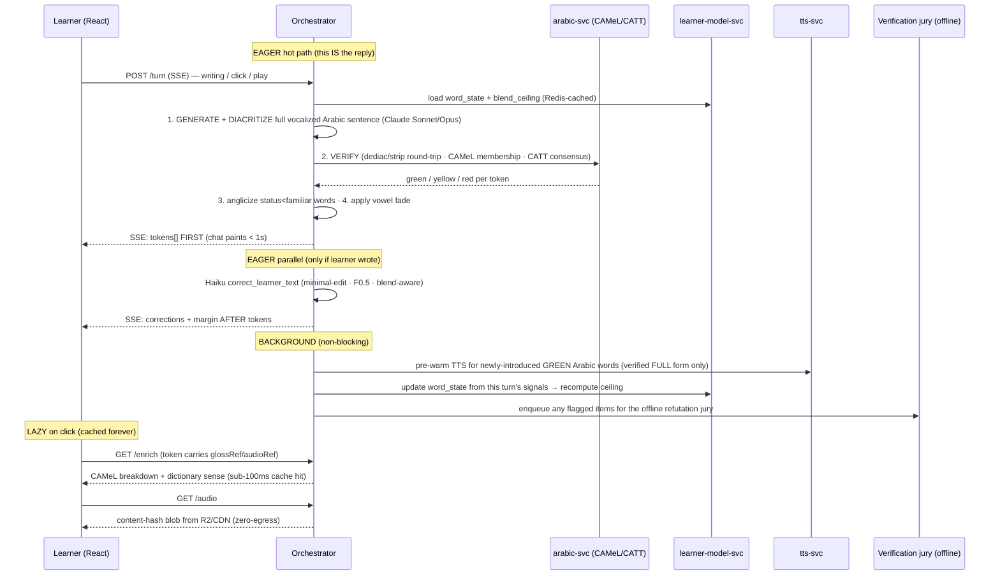

# language-agent — Consolidated v1 Design Spec

> **Status: committed v1 design spec** (`docs/plans/`). The single, reviewable, build-ready
> design for v1. It consolidates the product brief (`00`), the decisions log (`01`), the Spanish-baseline
> architecture synthesis (`20`), the competitive teardown (`21`), the brainstorm agenda (`22`), and the
> Arabic validation plan (`23`) into one opinionated spec. **It is not yet code.** Once the project is
> instantiated from the `agentic-seed` template, this file seeds the scaffolded repo's `DESIGN.md`
> (single design source-of-truth); from here the repo-root `DESIGN.md` is the binding design source-of-truth and this spec is the fuller v1 plan behind it. Nothing here is provisional unless an item is explicitly
> listed in §11 (Open questions / assumptions) — everything else is locked.

---

## 1. Overview & north star

**What it is.** `language-agent` is a chat tutor that teaches a complete beginner to **read** — and, secondarily,
**write** — Modern Standard Arabic (MSA) from absolute zero. It does this by holding a conversation that
**blends English with Arabic**: English-heavy at the start, with Arabic woven in word by word and ramping up as
the learner masters vocabulary. The reading surface is alive — every Arabic token is coloured by familiarity,
its short vowels fade as the word is learned, and any word is clickable for meaning, audio, and a root-and-pattern
breakdown. The learner's own writing is corrected in the margin, never inline. It is built on the **agentic-seed**
process template, which supplies the agentic PR/review/merge **process** and the `DESIGN.md` source-of-truth
discipline — not an app stack.

**Who it's for.** One reader: a **zero-Arabic, English-L1 adult** who wants to read formal written Arabic and has
been blocked before. It is a **solo personal project, built to grow** — clean foundations, Terraform, monorepo —
not a productized SaaS, but architected so it could become one.

**The north star.** From **zero → reading formal Arabic, including normal UNVOCALIZED text** — "access to all
Arabic writings." The honest terminal skill is reading an everyday Arabic newspaper, book, or Wikipedia article,
which is written as an **abjad** (consonants + long vowels only; short-vowel diacritics omitted). A from-zero
beginner cannot supply those missing vowels; the entire product is a ramp from fully-vocalized, English-scaffolded
text to bare, unscaffolded Arabic. **The real gate is vocabulary AND root-and-pattern morphology AND context** —
not vocabulary alone. A reader drops the vowels when pattern recognition lets them resolve a bare skeleton
(`ك ت ب` → *kataba* / *kutiba* / *kutub* / *kātib*) from shape + syntax. So the product teaches **vocabulary in
its morphological skeleton**, which is exactly why the click-card surfaces root + pattern, not just a translation.

**One-line thesis.**
> **Three fading scaffolds — the English→Arabic language blend, the full→bare vocalization fade, and the
> trainer-keyboard label fade — all ride on ONE per-(user, lemma, sense) mastery state, the single load-bearing
> primitive that simultaneously drives FSRS scheduling and the correction policy.** One data structure; the blend,
> the vowels, the keyboard, the review schedule, and what-counts-as-an-error all fall out of it.

"Training wheels come off" is the whole product philosophy, expressed three ways: **English recedes** (vocabulary
acquired), **vowels recede** (word mastery), **keyboard labels recede** (muscle memory).

---

## 2. Scope

### In scope for v1

- **Formal MSA only** — the one variety uniformly written, taught, and used in news/books/Wikipedia/official and
  literary text, and (decisively) the variety with the best diacritization tools, morphology engines, dictionaries,
  and TTS — which maximizes the reliability of the entire verification stack. Generator pinned to **high/formal MSA
  register**, not Qur'ānic (over-marked/archaic) and not colloquial.
- **Reading + writing both first-class**, but the **reading spine ships first** so the writing-correction loop rides
  a proven verification layer. Writing starts as cloze (fill-one-Arabic-word) and graduates to free production.
- **The three fading scaffolds** (language blend, vocalization fade, keyboard-label fade) on one mastery state.
- **Click-any-word** lookup: meaning · audio · add-to-list, with a "more →" root+pattern breakdown into the margin.
- **The automated-only verification layer** (the learner never sees red-band content).
- **Eastern Arabic-Indic numerals** (`٠١٢٣٤٥٦٧٨٩`) taught as an **early lesson**, rendered LTR-in-RTL.
- **A "decode the glyph" early stage** (the four contextual letter forms) before the "supply the vowels" stage.
- **Web-first**, responsive, RTL/bidi-correct from day one.
- **One named, pinned text persona** (no avatar).
- **`genanki` `.apkg` EXPORT** as the integration story.

### Explicitly DEFERRED (YAGNI — named, not scheduled)

| Deferred | Why deferred |
|---|---|
| **2nd target language** | Ship one. The analyzer adapter makes the next a swap, not a rewrite. |
| **Dialect content + Arabizi** (`7`=ḥ, `3`=ʿayn, `2`=hamza) | Distinct varieties with their own lexicon/grammar/orthography — **future content/curriculum, NOT a voice toggle.** Surfaced as a one-line onboarding FYI so `3al t2eel` reads as "different convention," not "broken Arabic." |
| **Speaking / ASR / pronunciation scoring** | Low value before the learner is Arabic-heavy; heavy STT+scoring loop. |
| **Constituent / clause-level blending** | v1 is **word-level content-word insertion**. Climb the *unit* later; model the blend as a vector (`density × unit × read/write`) so this is not a re-architecture. |
| **Per-user FSRS weight optimization / DKT / LLM knowledge-tracing** | Ship published default FSRS weights; re-optimize only after hundreds of reviews accrue. |
| **Mobile-native app / PWA** | Web-first. |
| **Animated avatar** | Persona *voice* without avatar cost. |
| **Anki import / cross-device sync** | Ship `.apkg` export only. |
| **Self-hosting the tracing/eval backend** | Start on managed **Braintrust** (tracing vendor resolved, §8); self-host only if volume demands. |
| **MCP-UI / iframe widget transport** | Native first-party components over JSON; wrong tool for a reader. |
| **A user-facing density dial as the PRIMARY control** | The blend is "an axis, not a setting." A humane **"more English" / "more vowels" override** is fine; a dial as the main driver is not. |
| **Karaoke / audio word-timing read-along** | Cosmetic; requires TTS timing-mark extraction + an audio↔token sync contract; **not on the path to reading unvocalized text** (the north star is decoding, not following along to audio). |

### Diglossia honesty note (load-bearing onboarding copy)

MSA (fuṣḥā) has ~335M users and **zero native speakers** — everyone's mother tongue is a regional dialect learned
at home; MSA is learned later at school. A learner who masters reading MSA can read a newspaper but **cannot follow
two Egyptians talking or a WhatsApp thread.** The persona's onboarding must say this plainly: *"You are learning to
read the **formal written standard.** This is the language of newspapers, books, and Wikipedia — not the everyday
spoken language of any one country, and not the informal Arabic (or Latin-letter 'Arabizi') of social media. Those
are different content we may add later."* Without this, the product over-promises.

---

## 3. Pedagogical model

The product is comprehensible-input theory made mechanical.

### Comprehensible input = the coverage floor

"Comprehensible input" (i+1) is operationalized as a **hard generation constraint, not a vibe**, pinned to ONE
formula so a builder can implement it literally:

> **`unknownTokenShare = count(tokens with status == new) / count(content tokens) ≤ 0.05`** — i.e. **≥95% known-word
> coverage.** English-fallback tokens count as **KNOWN/covered** (an English fallback is not an error; §"Correction"),
> so "known" spans mastered Arabic *plus* English scaffolding and "unknown" is only brand-new Arabic. The denominator
> is **content tokens** (the same denominator as the blend `ratio`, `count(lang==ar)/contentTokens`), not all tokens
> and not Arabic-only tokens.

This is the load-bearing pedagogical rule and the **server-side rejection threshold** of the generation guard
(`guard: regenerated:coverage` — a turn over `0.05` is regenerated). The blend *ratio* is the dial that moves
**inside** the coverage floor, never through it. Coverage is the constraint; ratio is the freedom within it.

### The three fading scaffolds

1. **Language blend (English → Arabic density).** Early text is English with high-frequency Arabic content words
   woven in; the Arabic share rises over time. Each token carries a `lang` tag, so the blend ratio is a **measurable
   property of the payload** (`count(lang==ar)/contentTokens`), never an opaque setting.
2. **Vocalization fade (full → minimal → bare).** For a token rendered in Arabic, how many short vowels (ḥarakāt)
   are shown fades with mastery — `new/learning` → full, `familiar` → minimal (only disambiguating marks),
   `known` → bare. Two tracks (lexical vowels vs case-endings; §4).
3. **Keyboard-label fade.** The on-screen trainer keyboard labels each QWERTY key with the Arabic letter it
   produces; labels recede as typing muscle memory builds. Muscle memory is **per physical key, not per word**, so
   this scaffold reads a **separate small per-`(user, qwerty_key)` typing-mastery counter** (correct keystrokes and
   error-rate for that key), faded **per key independently** — explicitly **not** the per-`(lemma, sense)` word_state
   that drives the other two scaffolds (§4).

The **blend and vowel fade** read the **same** FSRS-derived per-(user, lemma, sense) status, so they advance in
lockstep with zero extra state. The **keyboard-label fade** is the one exception: muscle memory is per physical key,
so it rides a small separate per-`(user, qwerty_key)` typing-mastery counter (above), not the word_state — these are
two orthogonal mastery dimensions (vocabulary vs typing) and conflating them would be wrong.

### Mastery-driven advancement — the signal ranking

Mastery is what advances the scaffolds. Signals are ranked and mapped to FSRS `Rating`, with implicit signals
weighted **far below** explicit ones (because "didn't click" ≠ "knows it" — maybe they skimmed):

| Rank | Signal | Direction | FSRS effect |
|---|---|---|---|
| 1 (strongest) | **Correct unprompted use in writing** | promote | `Good` / `Easy` |
| 2 | **Explicit review grade** | promote/demote | graded |
| 3 | **Word click** (a soft "I didn't know this") | **demote** | `Again`-ish — *lowers* status so scaffolds re-add support |
| 4 (weakest) | **Passive read without click** | weak promote | minimal |

Crucially, a click **lowers** status — so the scaffolds **breathe**: vowels can re-appear, a word can drop back to
English. The blend and fade do not monotonically climb; if the learner's Arabic error-rate spikes, the ratio drops
back and the margin explains *why*, so a more-English turn never reads as punishment.

### Spaced repetition

**FSRS** (via `py-fsrs`) is the single memory engine — no SM-2, no hand-rolled HLR. On top of it sits a
**LingQ-style legible status** (`new → learning → familiar → known → ignored`) **derived from** FSRS
`(stability, difficulty, retrievability)` (e.g. `S > 30d & R > 0.9 ⇒ known`), so the human-legible status and the
scheduler can never disagree. Prefer **in-context review** — the agent naturally re-uses a due word in a later
turn — over a separate deck; auto-prune `known` to avoid review debt. Ship published default FSRS weights.

---

## 4. The engine

### The single primitive: per-(user, lemma, sense) mastery state

One row per `(user_id, lang, lemma, sense_id)` in the `word_state` table — the source of truth that drives
**FSRS, the blend, the vowel fade, and the correction policy** at once.

```
word_state (user_id, lang, lemma, sense_id) →
  diac_canonical   -- the ONE verified fully-vocalized string (the form everything subtracts from)
  skeleton         -- the bare consonantal skeleton (dediac of the canonical)
  root, pattern, pos, gloss   -- breakdown payload (from CAMeL analyzer, verified)
  fsrs: stability, difficulty, due, last_review
  status           -- {new, learning, familiar, known, ignored}  DERIVED from FSRS
  seen_count, clicked_count, correct_uses, source
```

(No `caphi`/phonemic-transcription field in v1: nothing reads it — audio is TTS from the verified full vocalized
form, and pronunciation/ASR scoring is DEFERRED. It is recomputable from the analyzer on demand, so add it back when
ASR is un-deferred.)

A **second, much smaller state** lives beside this primitive only for the keyboard-label fade:

```
typing_mastery (user_id, qwerty_key) →
  correct_keystrokes, error_count, last_used   -- per physical key; drives label fade (§3 scaffold 3); NOT word_state
```

**Mastery keys on the disambiguated SENSE, never the bare orthographic form.** Because one skeleton maps to many
words (`ك ت ب`), "mastered *kataba*" must not auto-unvocalize or auto-blend the homographic *kutub* / *kutiba*.
The `(lemma, sense_id)` key (CAMeL `lex` + gloss supplies it) is what prevents homograph cross-contamination
across all three scaffolds.

### The blend — advancement: time-ratcheted ceiling × mastery allocation

The reconciled answer to "time vs mastery" is **both, with distinct jobs**:

- **Time ratchets the ceiling.** A global `blend_ceiling` rises on a slow, **activity-gated** schedule (a small
  step per active week — an absent learner doesn't drift). This is the **floor against stalling**: a present but
  plateaued learner still feels forward motion. Pure-mastery advancement stalls; that is the single biggest
  pedagogical failure mode.
- **Mastery allocates beneath the ceiling, word by word.** Per-word FSRS status decides *which* specific words fill
  the budget. A word graduates into the unglossed Arabic stream once it reaches `familiar`/`known`. The aggregate
  of these per-word decisions **is** the realized ratio, capped by the ceiling and floored by the **≥95% coverage**
  constraint defined once in §3 (`unknownTokenShare ≤ 0.05` over content tokens).

Two users at the "same stage" see **different sentences** because their known-word sets differ — the blend is
per-reader, not per-lesson. The blend **breathes down** when the Arabic error-rate spikes. Read and write are two
decoupled dials: `read_ratio` runs **ahead of** `write_ratio` (recognition precedes production); early writing is
cloze, fill-one-Arabic-word.

### The vowel fade — subtraction from one verified form

The single most important implementation rule: **store ONE verified fully-vocalized canonical form per
(lemma, sense); FADE BY SUBTRACTION, NEVER REGENERATE.** Re-diacritizing at each fade step would reintroduce error
at every level; subtracting from one verified full form makes the partial and bare states **inherit the full form's
verified correctness for free**. The fade strips **only the vowel-bearing diacritic marks** — **never** the
consonantal skeleton, the long-vowel/seat letters (alif `ا`, wāw `و`, yāʾ `ي`), hamza seats, or tāʾ marbūṭa — or it
produces non-words.

**The single source of truth for "what is a strippable mark" is CAMeL Tools' `dediac` function — the fade and the
verification round-trip MUST call exactly that function, never a hand-rolled codepoint range,** so the two can never
disagree. The mark set it removes (state it explicitly so a builder can audit it) is: the tashkīl block
**U+064B–U+0652** (fatḥa/kasra/ḍamma/sukūn/tanwīn/shadda), **U+0670** SUPERSCRIPT/DAGGER ALEF (a vowel-bearing mark
in extremely common words — هٰذا, اللّٰه, رَحْمٰن — that a naive U+064B–0652 range silently strands), **U+0653**
MADDAH ABOVE, **U+0654/U+0655** HAMZA ABOVE/BELOW, and **U+0656–U+065F** plus the Qur'ānic marks **U+06D6–U+06ED**
should any ever appear. It **excludes** U+0640 TATWEEL (a non-mark stretching joiner) and all consonantal/seat
letters. Both sides of the dediac round-trip (§5) compare **NFC-normalized** strings produced by this same
`dediac` call, so the load-bearing hard gate cannot disagree with the fade over a stranded dagger alef.

**Partial vocalization is defined by the analyzer's ambiguity set, not a fixed rule.** Run the bare skeleton through
CAMeL Tools' morphological analyzer: if it has **one** legal analysis, no marks are needed; if **many**, keep only
the vowel(s) that disambiguate to the intended sense. This makes the fade the canonical minimal-diacritization use
case.

**v1 LOCKS this analyzer-ambiguity-set definition as the meaning of `vowelState: "minimal"`** (definition A): minimal
= the smallest set of marks that resolves the bare skeleton to the intended `(lemma, sense)` per CAMeL's analysis. It
is chosen because it is the only definition **computable by subtraction from the one verified form without per-learner
regeneration** — it never depends on the reader. The per-learner *mastery* dimension is expressed entirely by **which
words sit at `minimal` vs `bare`** (the status → fade-step mapping above), **NOT** by varying what "minimal" means
inside a single word. The rejected alternative — "keep marks for vowels the learner hasn't mastered yet" — would make
the same word render differently per reader and is not v1. (A native-naturalness sanity check on the resulting minimal
forms is a **build task**, not an open design question — see §10 Phase 4.)

**Two fade tracks, faded independently:**
1. **Lexical / stem vowels** — needed to know the word.
2. **Inflectional case/mood endings (iʿrāb)** — the final vowels: MSA-formal, grammar-driven, the steepest sub-wall,
   exactly where every diacritizer errs most, and what natives drop in speech.

**Drop the case-ending track FIRST.** It is the least lexically informative, the hardest, and the least reliable
mark to render — so removing it early both matches real pedagogy (the iʿrāb is learned last) and removes the
least-trustworthy mark from the screen. The fade is therefore simultaneously a **grammar-difficulty ramp**.

**Phasing of the two tracks (resolves "what does the single-knob fade do with case endings before the two-track
split exists").** Phases 0–3 render **PAUSAL** — the final iʿrāb mark is **always stripped**, on every word,
independent of mastery — so "drop case-endings first" is trivially honoured the moment the fade ships, and beginner
text reads the way MSA is commonly sounded out. Only the **lexical/stem-vowel** track is mastery-graded in Phases
0–3. Phase 4's "two-track vowel fade" then adds the *graded* lexical-track subtraction described above on top of the
already-pausal base; it does not introduce case endings that were previously shown. (This supersedes the earlier
"pausal vs full" open question — pausal early is now locked.)

A manual **3-step slider (Full · Minimal · Off)** overlays the automatic per-word fade as the learner's override,
plus a hold-to-reveal and a hide-all self-test (§6).

### How the three scaffolds share one state

| Scaffold | Reads from mastery state | Effect of a low/lowered status |
|---|---|---|
| Language blend | `status ≥ familiar` ⇒ token may render in Arabic | English (or re-anglicized) |
| Vowel fade | `new`/`learning`→full, `familiar`→minimal, `known`→bare (`ignored`→bare) | more vowels re-appear |
| Keyboard labels | per-`(user, qwerty_key)` typing-mastery counter (NOT word_state) | labels stay visible longer for that key |

A word click lowers status → the **two word-keyed** scaffolds (blend + vowel fade) back off for that word in lockstep
off the one `word_state`; the keyboard-label fade is orthogonal (per-key typing mastery, not per-word), so it is
unaffected by a word click. No separate state for the two word-keyed scaffolds, no disagreement.

### Generation ordering — the splice-killer

The defining Arabic delta from the Spanish baseline. The blend is a **post-process over verified Arabic**, never
free-form bilingual generation:

```
1. GENERATE the FULL, fully-vocalized Arabic sentence       (Sonnet/Opus, register-pinned MSA)
2. VERIFY it through the trust stack (§5)                    (dediac round-trip · CAMeL · CATT · jury)
3. ANGLICIZE the not-yet-mastered words (status < familiar) (whole NP/verb at clause boundary only)
4. APPLY the vowel fade by subtraction per surviving Arabic token
```

This removes **"Frankenstein splice" as an entire failure class**: the model never generates a half-Latin/half-Arabic
token, because the blend operates by *removing* whole verified Arabic constituents and substituting their English
gloss — it never *constructs* a mixed token. Code-switching's **free-morpheme constraint** is enforced structurally:
**insert only whole noun-phrases and verbs at clause boundaries; never attach an Arabic clitic (`ال`, `bi-/li-/ka-`,
`wa-/fa-`, pronoun suffixes) to an English stem; never split inside a construct state (iḍāfa).** Any token that
emerges half-Latin/half-Arabic is auto-rejected by the morphology pass.

---

## 5. Verification layer

**Risk #1 is diacritization correctness** — a wrong vowel is a *different real word*, silently, and **neither the
learner nor the operator reads Arabic**, so it can't be eyeballed. Correctness is therefore not a feature; it is the
product. v1 is **automated-only** (no paid native calibration), with a conservative withhold-on-uncertainty posture
and the native-calibration path built as a drop-in.

The crown-jewel insight: **the agent knows the intended lemma + sense BEFORE it vocalizes**, which turns the
unanswerable "is this vowel right?" into a tractable **dictionary-membership lookup**.

### The diacritization stack

| Role | Tool | Job |
|---|---|---|
| **Primary diacritizer** | **Claude** (Sonnet/Opus) | SOTA on the clean SadeedDiac-25 set (~1.39 DER / ~4.67 WER with case endings, 0.82% hallucination — beats GPT-4, Gemini, and specialist models). The LLM already in the loop **is** the diacritizer. |
| **Deterministic spine** | **CAMeL Tools** (MIT, in-process Python) | `dediac` for the strip/fade + round-trip (the single source of truth for which marks are strippable, §4); the **morphological analyzer** to (a) enumerate legal vocalizations of a skeleton and (b) emit the breakdown fields (`diac`, `lex`/lemma, `root` `ك.ت.ب`, `pattern`, `pos`, `gloss`). |
| **Independent 2nd diacritizer** | **CATT** (Apache-2.0, offline) | Its job is to **disagree**. Two independent diacritizers disagreeing on a core word is the highest-signal error flag. |

### The automated trust stack (deterministic-first)

**Per-word diacritization check (hot path, cached per `(lemma, sense)`):**
1. The agent emits the diacritized Arabic **plus** the intended lemma + English gloss + features it meant.
2. **Dediac round-trip (HARD GATE):** `NFC(dediac(LLM_output)) == NFC(original_skeleton)`? Catches any hallucinated,
   dropped, or transposed letter instantly — needs zero Arabic literacy. **`dediac` is CAMeL Tools' function — the
   exact same one the vowel fade calls (§4)** — so the gate and the fade share one definition of "strippable mark"
   (covering U+0670 dagger alef and the maddah/hamza marks, not just U+064B–0652) and can never disagree.
3. **CAMeL membership against the intended sense (the key trick):** the vocalized form must be one of the legal
   `(diac, lex, gloss, pos)` tuples for the skeleton, **AND** the tuple whose `gloss` matches the **intended** sense
   must be the one chosen. Intended-gloss → different diac than emitted ⇒ **reject.** The known meaning *fixes* the
   vocalization.
4. **Tool consensus:** require **CATT** (Farasa **deferred** as an optional third diacritizer — v1 ships CATT as the
   sole independent 2nd diacritizer, matching the §8 stack and §10 phases) to agree on the **core-word** diacritics;
   **ignore case endings** (tools disagree most there; beginners don't need them yet). Disagreement → flag.
5. **LLM-judge tiebreak only on tool-disagreement or out-of-lexicon** (`NO_ANALYSIS`/backoff — not automatically
   wrong for proper nouns/neologisms): a **diverse-family** jury (Claude + Gemini + GPT, so errors decorrelate),
   **refutation-framed** ("Find the error in this diacritization, or state there is none" — never "is this right?",
   which invites a sycophantic yes), **majority gate.**

**Generated blended-sentence check** (over the full Arabic, before anglicizing):
(a) **(hot, gating)** CAMeL tokenize + disambiguate — `NO_ANALYSIS` on any non-proper-noun token = junk word ⇒
reject;
(b) **(OFFLINE, pre-generation only — NOT a hot-path band)** semantic round-trip: back-translate the Arabic to
English with a *different* model than generated it, embed both, check meaning preservation against the intended
gloss. This is a **second-opinion sanity check run at curriculum pre-generation alongside the refutation jury**, not
a locked v1 verification layer, so its cosine score does **not** drive the live GREEN/YELLOW/RED bands (which rest
only on the four locked layers — dediac round-trip, CAMeL membership, CATT consensus, refutation jury). It re-checks
meaning that CAMeL membership-against-the-intended-sense already pins; keeping it offline avoids a second per-turn
model call on the hot path;
(c) **(OFFLINE, pre-generation)** diverse-model refutation jury on grammaticality, majority gate.

**Writing-correction check** (over the learner's text *and* the proposed correction): run both through the same
diacritization/morphology checks; require the judge to **classify each edit** (real error / stylistic / no-op) and
**drop no-op edits**; bias **precision over recall** (F0.5, precision-weighted 2×) — better to miss an error than to
"correct" already-correct Arabic and confuse a beginner; blend-aware (an English fallback word is **not** an error).

### GREEN / YELLOW / RED gating — the learner NEVER sees red

The bands are computed at **two levels**, because their triggers are attributable at different granularities. Gating
rests **only on the four locked layers** (dediac round-trip, CAMeL membership, CATT consensus, refutation jury); the
offline semantic round-trip does not set a band.

**Per-TOKEN band** (driven by the per-word checks — dediac round-trip, CAMeL membership against the intended sense,
CATT core-word consensus) — sets each token's `confidence`:

| Band | Condition (per word) | Behaviour |
|---|---|---|
| **GREEN** | all per-word deterministic checks pass | surface normally |
| **YELLOW** | CATT/Claude disagree on the core word, or out-of-lexicon backoff | surface but **suppress the vowel-fade for that word** (show full) + add a margin note |
| **RED** | dediac round-trip fails, or CAMeL membership rejects the intended sense | **withhold** — substitute a known-good cached word, or fall back to English |

**Per-SENTENCE band** (driven by the whole-sentence checks — grammaticality refutation jury, and the offline
semantic round-trip when pre-baking) — a sentence-level signal is **not** attributable to a single token, so it
maps to rendering as:

| Band | Condition (per sentence) | Behaviour |
|---|---|---|
| **GREEN** | jury unanimous / meaning preserved | surface normally |
| **YELLOW** | minor jury disagreement | surface; **annotate the margin** — do **not** change any per-token `vowelState` |
| **RED** | jury majority finds an error / meaning not preserved | **regenerate the whole sentence** (never ship a sentence-RED) |

A green-band risk target governs the per-token gate. **Green-band risk is defined precisely as: the fraction of
GREEN-banded content-word tokens whose core-word diacritization differs from the golden reference (case-endings
excluded).** v1 target: **≤ 2.0%** measured on the golden set, and the deploy gate is **an exact threshold of 2.0% on
that metric PLUS no regression versus the last shipped golden-set run** (so CI computes a hard pass/fail; §8).
Case-ending disagreement between tools is **non-blocking** in v1 (render conservatively/pausally early).

### TTS gate (a verification invariant, not just risk-table prose)

Audio is downstream of the gate, so the rule is stated here where it is checkable: **tts-svc accepts ONLY the
verified full `diac` string of a token whose `confidence == green`.** It must (1) be fed the verified **full**
vocalized form **regardless of the visual fade**, never the bare `skeleton`; (2) **disable any vendor
auto-diacritizer** (the engine's own guess can re-introduce the error the gate just removed); and (3) **reject a bare
skeleton** outright. **No `audioRef` is emitted for a non-green token** — a YELLOW/RED word never gets synthesized.
This is a **tts-svc contract invariant**, enforced at the service boundary, not advice.

### Hot path vs offline

- **Hot path:** the deterministic per-word checks (dediac round-trip + CAMeL gloss-constraint + CATT tool consensus)
  — cheap and **cached per `(lemma, sense)`.**
- **Offline / pre-generation:** the expensive diverse-family refutation jury **and the semantic round-trip
  second-opinion** run when **pre-baking curriculum content**, touching the live path **only** when the hot per-word
  checks flag (out-of-lexicon, tool disagreement, or live writing corrections that can't be pre-baked). Verified
  tuples cache forever; verification cost amortizes to near-zero as the learner's vocabulary stabilizes.

### Golden sets + the drop-in native-calibration path

Golden sets are built **without an Arabic-literate operator**: seed diacritization regression from already-diacritized
gold corpora (**Tashkeela**, WikiNews multi-reference); glosses/grammar from the **CAMeL lexicon**; corrections from
**QALB-2014/2015** parallel error→correction data. Grow a product-specific set by **logging every red/yellow item and
what shipped.** Every model swap / prompt change / fade-logic change reruns the golden set and gates deploy on
no-regression (Braintrust is the natural home for scorers + traces; see §8).

**Native calibration is NOT purchased in v1, but is built as a drop-in:** log low-confidence items, keep the golden
sets, hold the conservative withhold-on-uncertainty posture. The hook for later: a weekly sampled batch
(~50–100 items, weighted to yellow-band + fade transitions) adjudicated by a native speaker, scored as Cohen's κ vs
the automated gate (target κ ≥ 0.8); a κ drop signals judge drift → re-tune thresholds. Dropping this in requires no
re-architecture — only turning on the already-built logging + adjudication path.

---

## 6. UX design

### Layout — the 3-column "reading desk"

```
┌───────────────┬─────────────────────────────────┬──────────────────┐
│  TOOL RAIL    │        CONVERSATION (spine)      │      MARGIN      │
│  (left)       │        (center, drives all)      │      (right)     │
│               │                                  │                  │
│ • word list   │  persona turn:  English … آرَابِك  │  glosses (lag)   │
│   (= mastery  │  … woven Arabic, status-tinted,  │  grammar notes   │
│   state made  │  vowels fading inline            │  corrections     │
│   visible)    │                                  │  (categorized)   │
│ • persona     │  learner turn:  typed Arabic     │  encouragement   │
│   (pinned)    │  (corrected in margin →)         │                  │
│ • vowel slider│                                  │  margin LAGS the │
│ • keyboard    │  [trainer keyboard on input]     │  spine one step  │
└───────────────┴─────────────────────────────────┴──────────────────┘
        RTL: every token in <bdi>/isolates · numerals LTR-in-RTL
```

Everything is visible at once. **The conversation drives; the tools are lenses on it, not separate modes.** Below
~1024px the margin collapses to tap-expand chips (Tufte layout); the tool rail collapses to icons.

### Default token render — status-tint + inline vowel-fade

The reading surface **is** the progress display. By default:
- **Arabic words are coloured by familiarity** — the 5-band status collapses to 3 tint buckets: `new` and `learning`
  share the **new/learning** tint, `familiar` and `known` share the **known** tint, and `ignored` renders un-tinted
  (greyed like English) — so the eye is pulled to the Arabic the learner is actively acquiring.
- **English is greyed**, receding so attention lands on the target.
- **Vowels fade inline by mastery** — `new`/`learning` = full ḥarakāt, `familiar` = minimal (disambiguating only),
  `known` = bare — running *underneath* the manual slider. The 5-band status collapses to 3 vowel-fade steps:
  `new`+`learning` share the full step, `familiar` is minimal, `known` is bare, and `ignored` renders bare
  (un-tinted; see the colour rule below).
- A **calm-down toggle** reduces marking when the surface feels busy (status tints flatten; only the vowel state and
  clickability remain).

### Click-a-word — hybrid popover + margin expansion

- **Compact popover at the word:** contextual meaning · audio (play) · add-to-list / know-it. No LLM round-trip on
  the common path — the token already carries `glossRef`/`audioRef` cache keys, so a click is a sub-100ms cache hit.
- **"more →" expands the full root + pattern breakdown into the margin.** Example payload:

  > **مَكْتَبَة** · *maktaba* · 🔊
  > meaning (in context): **library / bookshop** — "a place of books"
  > **root** ك-ت-ب (writing) · **pattern** مَفْعَلة ("a place of") → *place of books*
  > POS: noun · fem · sing
  > **root family:** كِتَاب *kitāb* (book) · كاتِب *kātib* (writer) · مَكْتَب *maktab* (office/desk)
  > [ add to list ] [ know it ]

  The root + pattern payload is the muscle that teaches vowel-dropping — it is *why* the click-card exists, not a
  nicety. Comes straight from CAMeL's analyzer (no LLM call for the structural fields).

### Vowel control — Full · Minimal · Off slider

A **3-step slider (Full · Minimal · Off)** is the primary manual control, layered **over** the automatic per-word
fade (which the slider overrides). Plus **hold-a-word-to-reveal** (peek the full vocalization of a faded word) and a
**hide-all self-test key** ("do I still know this word without the vowels?"). "Minimal" is a deliberate
disambiguating-marks-only mode driven by the analyzer's ambiguity set.

### Writing input — native typing on the fading trainer keyboard

- **Native Arabic typing on the standard Arabic-101 layout**, via an on-screen **trainer keyboard** that labels each
  QWERTY key with the Arabic letter it produces — so the learner builds the **real**, transferable layout.
- **Labels fade as muscle memory builds** (the third scaffold).
- **Harakat on Shift.** Early on the agent can **auto-vowel + verify the typed skeleton** (the learner types the
  bare consonants; the agent diacritizes and runs the verification pass before scoring).
- **VERIFY the layout mapping against the official Arabic-101 spec at build** (an open build-time task; §11).

### Margin — lags the spine

The margin carries glosses, grammar notes, categorized corrections, and encouragement. **It lags the spine by one
step** in its own blend: English early, migrating to simple Arabic as the conversation's blend matures. This keeps
the spine reading like a real conversation (not a graded worksheet) while the margin stays the comprehension floor.
**Corrections render here, never inline** — they never interrupt the conversation spine.

### Word list, persona, RTL/bidi

- **Word list** — a tool-rail panel that is **the mastery state made visible**: a read-view on the one primitive
  (per-(user, lemma, sense) status) that the blend, fade, and correction already depend on.
- **Persona** — one named character, **pinned** in the cached system prefix and re-injected each turn to prevent
  drift over a long blended chat. No avatar (avatars read as gimmicky and add lip-sync bugs).
- **RTL / bidi (first-class correctness):** wrap **every token** in `<bdi>` / isolates (prefer Unicode isolates
  U+2066–2069 over embeddings); **operate on logical characters, not visual glyphs** (four-way contextual letter
  shaping — isolated/initial/medial/final — corrupts if you index glyphs). **Eastern Arabic-Indic numerals**
  (`٠١٢٣٤٥٦٧٨٩`), taught as an early lesson, rendered **LTR-inside-RTL.** Fonts: **Amiri or Scheherazade New**
  (designed for ḥarakāt; Noto Naskh renders diacritics too small for a vowel-teaching tool); line-height ≥1.8,
  Arabic sized ~10–15% larger. Visual-regression snapshots on a fixed set are the operator's only eyeball-able guard.

---

## 7. System architecture

### Three tiers

```
┌──────────────────────── PRESENTATION (React web) ─────────────────────────┐
│ Reading desk (3 columns) · <TokenStream> delegated-click · Radix popover   │
│ word-card · CSS Custom Highlight (correction ranges) · trainer keyboard    │
│ Presentation + interaction ONLY. Talks to orchestration over SSE. No       │
│ backend service is reachable from the browser.                             │
└────────────────────────────────┬──────────────────────────────────────────┘
                 POST /turn (SSE) │ GET /enrich  GET /audio
┌──────────────────── ORCHESTRATION LAYER (separate service) ────────────────┐
│ The agentic loop + turn coordinator. OWNS THE HOT PATH. The single         │
│ contract to the frontend. Fans out to backend services; keeps synchronous  │
│ calls minimal + parallel; pushes expensive work async/cached off-stream.   │
└──────┬──────────────────┬──────────────────┬───────────────────┬───────────┘
       │ (sync, minimal)  │ (sync read /     │ (async/bg)        │ (async/bg)
       │                  │  async write)    │                   │
┌──────▼───────┐  ┌───────▼────────┐  ┌──────▼─────────┐  ┌──────▼──────────┐
│ arabic-svc   │  │ learner-model  │  │ tts-svc        │  │ (verification   │
│ (Python)     │  │ -svc           │  │                │  │  jury, offline) │
│ clitic seg · │  │ FSRS + word-   │  │ verified-full  │  │                 │
│ root/pattern │  │ state + word   │  │ form → TTS,    │  │                 │
│ dediac/strip │  │ list           │  │ R2-cached      │  │                 │
│ · verify     │  │                │  │                │  │                 │
│ (CAMeL/CATT) │  │                │  │                │  │                 │
└──────┬───────┘  └───────┬────────┘  └──────┬─────────┘  └─────────────────┘
       └─────── Neon (state) · Upstash (cache) · R2+CDN (audio) ─────────────┘
                       all on Cloud Run · scale-to-zero
```

### Hybrid microservice decomposition

Granularity = **HYBRID** — orchestrator + a *small set* of services grouped by **runtime × change-rate × scaling
profile** (not full per-capability microservices; not a monolith). In a **monorepo** with **shared contracts** and
**ONE Terraform tree.**

| Service | Runtime | Why its own service |
|---|---|---|
| **orchestrator** | TS/Node | The agentic loop + turn coordinator; single frontend contract; the hot path. Different language from the NLP, different change-rate from infra. |
| **arabic-svc** | **Python** | Wraps **CAMeL Tools + CATT**: clitic-aware segmentation, root/pattern morphology, **dediac/strip**, and **verify** (membership + CATT consensus + dediac round-trip). It does **not** add the vowels — primary diacritization is Claude's, produced during generation in the orchestrator (see note below). Polyglot boundary (Python NLP vs TS orchestrator); changes when linguistics change; CPU-bound. |
| **tts-svc** | (thin) | Diacritize-verified-form → audio; R2/CDN cached. Distinct scaling (bursty, cache-amortized), distinct vendor surface. |
| **learner-model-svc** | (thin) | FSRS + `word_state` + the word list. Owns the one primitive; low change-rate; DB-bound. |

All **Cloud Run** with **scale-to-zero** (`min-instances=0` to start → 1 with users) for low solo-project cost.

**Hot-path guard:** the orchestrator keeps synchronous service calls **minimal + parallel**; expensive work — the
verification jury, TTS pre-generation, learner-model updates — runs **async + cached, off the stream.**

**Where diacritization happens (reconciling the diagram with §5):** **generation, including Claude's primary
diacritization, lives in the orchestrator** — the larger model vocalizes as it generates the full Arabic sentence
(step 1). **arabic-svc owns dediac/strip, morphology, and the deterministic verification cross-check** (CAMeL
membership + CATT consensus + the dediac round-trip) — CAMeL and CATT *strip and cross-check* the vowels; they never
*add* them. The learner-model edge is a **synchronous read** of `word_state` + `blend_ceiling` on the hot path and an
**asynchronous write** (update + ceiling recompute) off the stream, per the hot-path guard above.

### Data-flow diagram of one turn



**Three lanes by latency budget:** *eager hot path* (the streamed reply, generate→verify→anglicize→fade);
*eager parallel* (Haiku correction, off-stream, renders a beat after the spine); *background* (TTS pre-gen,
learner-model update, jury enqueue) and *lazy-on-click* (enrich + audio from cache). The diacritization + verify
stages sit **inside** the hot path but lean on **cached verified tuples**, so the expensive jury rarely touches the
live stream.

### The content / message schema

Every assistant turn is a **`tokens[]` array; per-token `lang` IS the blend made measurable.** Corrections and margin
notes are **stand-off**, keyed to **stable token IDs (never raw offsets)**. `schemaVersion` + a tolerant reader
(ignore unknown fields, additive-only changes) ship **from message #1**. Field names borrow CoNLL-U
(`lemma`/`upos`/`feats`) and ERRANT (`R:VERB:TENSE`). The disambiguated sense — the primitive that prevents
homograph cross-contamination across all three scaffolds (§4, risk #5) — rides as an **explicit, structured
`senseId` field, never smuggled inside an opaque `glossRef` string**; `glossRef`/`audioRef` are *derived* from
`(lemma, senseId)`, and `word_state` updates key on the structured `(lemma, senseId)` pair, never on a string-split
of a cache key.

```jsonc
{
  "type": "tutor-message",
  "schemaVersion": "1.0",
  "messageId": "m_8f2a",
  "role": "assistant",
  "blend": {                          // the blend envelope
    "ratio": 0.34,                    // server-verified = count(lang==ar)/contentTokens
    "ceiling": 0.40,                  // time-ratcheted cap this turn fills under
    "advancedBy": "mastery",          // mastery allocates beneath the time ceiling
    "guard": "passed",                // passed | regenerated:ratio | regenerated:coverage | regenerated:coherence
    "unknownTokenShare": 0.04,        // = count(status==new)/contentTokens; coverage floor rejects > 0.05 (§3)
    "breathedDown": false,            // true if THIS turn's ratio was lowered below the ceiling-allowed value…
    "breathedDownReason": null        // …and why: "error-spike" | null. Drives the margin's "why it moved" copy.
  },
  "tokens": [
    { "id": "t0", "text": "Let's read about the", "lang": "en", "kind": "text" },
    { "id": "t1", "lang": "ar", "kind": "word",
      "diac": "مَكْتَبَة",            // verified full vocalization (the canonical form)
      "skeleton": "مكتبة",            // bare; fade subtracts toward this
      "vowelState": "minimal",        // full | minimal | bare  (per-word fade output)
      "lemma": "مَكْتَبَة",           // CAMeL lex
      "senseId": "library",           // EXPLICIT, STRUCTURED disambiguated sense — word_state
                                      //   updates key on (lemma, senseId), NEVER on a parsed cache-key string
      "root": "ك ت ب", "pattern": "مَفْعَلة",
      "upos": "NOUN", "feats": "Gender=Fem|Number=Sing",
      "status": "familiar",           // drives styling + which scaffold step
      "confidence": "green",          // green | yellow | red  (learner never sees red)
      "glossRef": "g/ar/مكتبة#library",       // DERIVED from (lemma, senseId) — a cache key, not the carrier of the sense
      "audioRef": "a/ar/مَكْتَبَة/ar-EG-Neural" // DERIVED from the verified FULL `diac` + voice; emitted ONLY when confidence==green (§5 TTS gate)
    },
    { "id": "t2", "text": ".", "lang": "en", "kind": "punct" }
  ],
  "corrections": [                    // stand-off; references the USER turn's token IDs
    { "id": "c0", "targetMessageId": "u_8f29",
      "op": "R", "origTokenRange": ["ut4","ut4"],
      "errorType": "R:CASE:ENDING", "severity": "grammatical",
      "blendStatus": "ar_error",      // ar_error | allowed_en_fallback | nudge_opportunity
      "note": "…", "noteLang": "en" } // note language migrates en→ar as blend matures
  ],
  "margin": [
    { "id": "n0", "kind": "grammar",   "anchorTokenId": "t1",
      "body": "مَفْعَلة marks a place — 'a place of books'.", "lang": "en" },
    { "id": "n1", "kind": "encourage", "anchorTokenId": null,
      "body": "Nice — you recognised that root unprompted!", "lang": "en" }
  ]
}
```

**SSE streaming order:** stream **`tokens` first** (chat paints immediately), then emit `corrections` and `margin`
as later parts (ERRANT alignment needs the whole corrected form; partial JSON can't be validated mid-stream). Key
everything to token IDs; when an offset is needed, emit **code-point** indices (not UTF-16). **SSE tripwire:**
disable proxy buffering explicitly (`X-Accel-Buffering: no`, `Cache-Control: no-cache, no-transform`) and verify
token-by-token arrival through the real proxy/CDN chain — buffering is invisible locally and batches tokens in prod.

---

## 8. Tech stack & infra

| Concern | Choice | Why |
|---|---|---|
| **Hosting** | **Cloud Run**, all services, `min-instances=0` → 1 with users | 60-min timeout headroom for the agentic loop; real per-instance concurrency; native HTTP/2; no sub-32MB buffering; clean Secret Manager env injection; **scale-to-zero** for solo cost. Lambda is streaming-hostile (30s edge idle). |
| **Primary data** | **Neon Postgres** | Serverless, scale-to-zero ($0 idle). Holds learner profile, `word_state` (the one primitive), conversation history, error ledger, **the verified `(lemma,sense,diac,root,pattern)` tuple store.** Co-located in the Cloud Run region for the per-turn state read. |
| **Cache** | **Upstash Redis** | Pay-per-command fits bursty interactive traffic. Caches the blend ratio/ceiling, glosses/breakdowns, TTS-text keys. TTLs bound cost. |
| **Audio blobs** | **Cloudflare R2 + CDN** | **Zero egress** — every replayed cached word costs nothing to serve. Audio cache-hit-rate *rises* as the blend deepens (recurring high-frequency vocab), so R2 amortizes TTS spend exactly when Arabic volume grows. |
| **Secrets** | **GCP Secret Manager**, injected as Cloud Run env vars | Never in TF code/state; `sensitive = true`; LLM/TTS keys never in `tfvars`. |
| **Tracing** | **Braintrust** (managed), OTel-wired — **resolved** (was Langfuse/Braintrust); Braintrust is the lower-friction pick because §5's golden-set scorers already want it and self-hosting Langfuse is on the DEFER list | Traces the agentic loop, token cost/turn, TTFT, the verification jury's marginal cost, **and hosts the golden-set scorers + traces** (§5). One integration, not two. |
| **NLP sidecar** | **CAMeL Tools + CATT Python service** (`arabic-svc`) | The deterministic spine (dediac + morphology) + CATT as the **independent 2nd diacritizer for the disagreement signal** — primary vocalization is **Claude's**, produced during generation, not a job this service performs. Its own Terraform module; in-process or subprocess (topology open — §11). Caches the verified tuple as a first-class store. |
| **IaC** | **Terraform** (or **OpenTofu** for native state encryption, reasonable given LLM/TTS keys land in state) | GCS remote state + versioning; **GitHub OIDC / Workload Identity Federation** (no long-lived keys); **folder-per-env** (beats workspaces for blast-radius). Modules: `network`, `cloudrun-app`, `secrets`, `data-neon`, `cache-upstash`, `storage-r2`, `observability`, `arabic-sidecar`. |

### LLM tiering

- **Bigger model (Claude Sonnet / Opus):** the blended-reply generation, **diacritization**, and the
  blend-advance judgment — content generation and correctness need the larger model.
- **Smaller model (Haiku):** corrections, glosses, breakdowns, and the coherence guard — assessment/correction
  suffices with the smaller model.
- Cache the persona + blend rubric + tool defs + glossary behind **one prompt-cache breakpoint** (pre-warm at
  session start). **Tripwire:** any per-request token (timestamp, turn counter) *before* the breakpoint busts the
  whole cache — keep volatile content after it.

### Slotting into agentic-seed's reviewed-PR / merge flow

The project is instantiated from **agentic-seed**, which supplies `AGENTS.md` (conventions, review-before-merge,
doc-drift Update Triggers) and `DESIGN.md` as the single design source-of-truth (this spec seeds it). CI/CD:

- A PR triggers `terraform fmt -check` / `validate` / **`plan`**, and **the `plan` comment IS the reviewed diff**
  that slots into agentic-seed's reviewed-PR gate. Reviewers approve infra by reviewing the plan, not the HCL.
- Merge to `main` triggers `apply` to prod via **OIDC**; the app image build + `gcloud run deploy` run in the same
  pipeline.
- The golden-set regression (§5) reruns on every model swap / prompt change / fade-logic change and **gates deploy on
  the exact bar: green-band risk ≤ 2.0% AND no regression versus the last shipped run** (CI computes a hard pass/fail
  on the metric defined in §5).

---

## 9. Top risks & mitigations (ranked)

| # | Risk | Mitigation |
|---|---|---|
| **1** | **Diacritization correctness** — a wrong vowel is a *different real word*, silently; no human in the loop reads Arabic. Highest severity, highest frequency, invisible. | The trust stack (§5): **dediac round-trip (hard) + CAMeL morphological-analyzer membership against the INTENDED lemma+sense + CATT core-word consensus (Farasa deferred) + diverse refutation jury.** Verify against intended sense, never "is this fluent Arabic." Withhold red. Green-band risk (fraction of GREEN content-word tokens whose core-word diacritization differs from golden, case-endings excluded) gated **≤ 2.0%** on the golden set with no regression. Drop-in native κ calibration. |
| **2** | **Over-correction** — the model "fixes" already-correct Arabic or the allowed English fallback (Arabic GEC's punctuation over-correction is documented); destroys learner trust. | **Classify-then-filter edits, drop no-ops, F0.5 precision-bias** (precision 2×), minimal-edit + verification pass, **blend-aware** (below-stage English ≠ error), LanguageTool/Farasa cross-check. Correction renders in the margin, never inline. |
| **3** | **Frankenstein blends** — an English word inserted mid-iḍāfa / breaking agreement / splitting a clitic; Arabic's VSO + agreement make this far likelier than Spanish. | **Generate full Arabic → verify → anglicize as a post-process** (removes splice as a failure class). Insert only whole NPs/verbs at clause boundaries; never attach Arabic clitics to English stems; the morphology pass auto-rejects half-Latin/half-Arabic tokens. |
| **4** | **Latency** — the added diacritize + verify + sidecar stages, per-word lookups, or synth-on-click make interaction sluggish; clicks/corrections must feel <300–500ms. | One streamed Sonnet call + cached verified tuples on the hot path; the **expensive jury runs offline at pre-generation**, hot only on flag; correction in parallel off-stream; **lazy per-word enrichment from cache** with agent-emitted sense pre-annotation; prompt-cache the stable prefix; pre-warm TTS for new words in the background. |
| **5** | **Homograph cross-contamination** — mastering one sense of a skeleton wrongly strips vowels / blends a *different* word that looks identical. | **Mastery, fade, AND blend all gate on the disambiguated `(lemma, sense_id)`, never the bare orthographic form.** CAMeL `lex` + gloss supplies the sense key. |
| **6** | **RTL / bidi corruption** — un-isolated spans, glyph-vs-logical-char operations, numerals breaking order, a stripped long-vowel letter producing a non-word; all invisible to a non-reader operator. | `<bdi>`/isolates on **every** token; operate on **logical characters, not glyphs**; numerals **LTR-in-RTL**; **fade by subtraction** via CAMeL `dediac` (the single source of truth for strippable marks — covers U+064B–0652 **plus** U+0670 dagger alef and the maddah/hamza combining marks, excludes U+0640 tatweel; §4), never the skeleton or long-vowel letters; NFC-aware compare on both sides of the round-trip; **visual-regression snapshots** as the operator's only eyeball-able guard. Amiri / Scheherazade New. |
| **7** | **Cold-start & implicit-signal noise** — no per-word data on day 1; "didn't click" ≠ "knows it" over-promotes words. | CEFR/frequency-band placement probe + frequency prior + the **time ceiling** carry early sessions; ship default FSRS weights; **weight implicit signals far below explicit** (writing correctness ≫ review grade ≫ click ≫ passive read). |
| **8** | **Schema / offset drift** — the token schema evolves weekly early; offset-keyed corrections/highlights land on the wrong word if anything re-tokenizes. | `schemaVersion` + tolerant-reader (additive-only, ignore unknown fields) **from message #1**; **key all stand-off annotations to stable token IDs, never raw offsets**; pin CAMeL/CATT/dictionary versions so cached offsets don't silently drift; emit **code-point** (not UTF-16) indices. |

(Adjacent, folded in: **TTS teaching a wrong pronunciation** — mitigated by generating audio only from the verified
**full** vocalized form, after the gate, **never** from bare consonants and **never** via a TTS engine's own
auto-diacritizer; and **over-promise from diglossia** — mitigated by the honest onboarding copy in §2.)

---

## 10. Phased build order

The thinnest end-to-end vertical slice first, then richness onto a working spine. **Build-phase order is independent
of in-product lesson order:** the curriculum-early lessons (glyph-decode, numerals — §2) appear early in the
*learner's path* but their *implementation* is low-risk content layered onto the proven spine, so some land in early
build phases for onboarding while the richer engine matures behind them. The phases below sequence by build risk; the
learner always meets the early lessons first regardless of when each was built. **Each phase ends in a shippable
reader**, and the locked manual controls (vowel slider, persona) exist *before* the auto-fade engine, not after it.

**Case-ending phasing (all phases):** Phases 0–3 render **PAUSAL** — the final iʿrāb mark is always stripped (§4) —
so "drop case-endings first" holds from the first lit pipe; Phase 4's two-track fade only adds the *graded*
lexical-track subtraction on top.

### Phase 0 — Walking skeleton: one coherent vocalized blended turn, verified, rendered RTL
The full pipe lit up, shallow. Cloud Run + Neon + minimal Terraform/OIDC; the `arabic-svc` sidecar (CAMeL/CATT)
stood up. The **named, pinned persona** is wired from the start (it is the cached system-prefix anchor — §6 — so it
belongs in Phase 0, not last). One Sonnet call **generates + diacritizes a full vocalized Arabic sentence → verifies
it (dediac round-trip + CAMeL membership) → anglicizes unmastered words at a fixed blend ratio → applies the pausal
vowel fade**, streamed over SSE. React `<TokenStream>` renders it **RTL with `<bdi>`/isolates, status tints, inline
vowel state, Amiri/Scheherazade New.** The two **curriculum-early onboarding lessons** — the **glyph-decode stage**
(the four contextual letter forms, taught *before* the supply-the-vowels stage so a learner has met the glyphs before
the fade gates on them) and the **Eastern Arabic-Indic numerals lesson** (rendered LTR-in-RTL) — ship here as
onboarding content. No clicks, no audio, no correction yet. Fixed ratio (no advancement). *Done = the learner is
onboarded through glyphs + numerals and reads one coherent, verified, vocalized blended reply rendered correctly RTL.*

### Phase 1 — Make it interactive: clickable + audio + manual vowel control
The clitic-aware enrich pipeline behind `/enrich` (CAMeL segmentation + root/pattern + dictionary sense); the hybrid
click-card (popover + "more →" margin breakdown). **TTS from the verified full vocalized form** (regardless of visual
fade), pre-warmed in the background, cached in R2/CDN, played from the card, **emitted only for GREEN tokens** (§5 TTS
gate). Agent emits sense annotations so clicks are cache hits. The **manual `Full · Minimal · Off` vowel slider +
hold-to-reveal + hide-all self-test** lands here — the learner's manual override must exist *before* the automatic
mastery-driven fade engine arrives in Phase 3, since the slider overrides that engine. *Done = click any Arabic word
→ instant gloss + root/pattern breakdown + correct audio, and the learner can manually control vowel density.*

### Phase 2 — Make it teach writing: native typing + correction
The trainer keyboard (Arabic-101, labels present), harakat-on-Shift, auto-vowel-the-skeleton. Parallel Haiku
`correct_learner_text` returning ERRANT-style categorized minimal-edit diffs as margin SSE parts, with the
**verification pass + F0.5 precision-bias + blend-aware policy** in from the start; corrections render in the margin,
categorized, never inline. Early cloze-style `write_ratio`. *Done = learner types Arabic natively, gets a blend-aware,
categorized correction in the margin.*

### Phase 3 — Make the scaffolds live: the mastery state drives everything
The `word_state` table + `py-fsrs`; LingQ status derived from FSRS. Wire the ranked signals (writing correctness,
review grade, click[negative], passive read) into the per-word ledger. Switch the fixed ratio to **time-ratcheted
ceiling × mastery allocation**; per-word render decisions fill the budget; the **automatic vowel fade** goes live off
the `word_state`, and the **keyboard-label fade** goes live off the **separate per-`(user, qwerty_key)`
typing-mastery counter** (§4 — muscle memory is per-key, not per-word). Cold-start placement probe. The blend
**breathes down** on error spikes (recorded as `breathedDown`/`breathedDownReason` in the blend envelope, §7); the
margin shows the live ratio and *why* it moved, driven by that payload field. The word-list panel renders the mastery
state. *Done = all three scaffolds advance per-reader — two on word mastery, one on per-key typing mastery, capped by
time, breathing down on errors.*

### Phase 4 — Polish & scale
Only true polish/scale layered onto the proven spine (the locked manual controls, persona, and curriculum-early
lessons already shipped in Phases 0–1):
the **two-track vowel fade** — Phases 0–3 are already pausal, so this phase adds the *graded lexical-track*
subtraction on top of the always-stripped case endings (§4); the **offline refutation jury** at curriculum
pre-generation **and the offline semantic round-trip second-opinion** (§5); the **drop-in native-calibration
logging**; margin migrating en→ar; the humane "more English"/"more vowels" override; `genanki` `.apkg` export;
**Braintrust** dashboards (vendor resolved — §8); `min-instances=1` + CPU boost.
(Karaoke / audio word-timing read-along is **cut** — see the §2 DEFERRED table.)

---

## 11. Open questions / assumptions

### Genuinely open (resolve at/by build)

1. **Vowel-toggle / fade-track granularity.** Is the manual toggle purely global on/off, or also **per-fade-track**
   (lexical vowels vs case-endings independently)? And is the fade **unit** the orthographic word or the
   **clitic-token**? (Locked: two tracks exist and case-endings drop first; the *toggle's* track-granularity is open.)
2. **Transliteration fallback.** Is romanized transliteration ever offered as a fallback on the writing-input or
   reading surface (a minor open detail), or is native script the only path from day one?
3. **Exact Arabic-101 keyboard mapping** — **verify the QWERTY→Arabic-letter map and the harakat-on-Shift positions
   against the official Arabic-101 spec at build.** (Locked: standard Arabic-101 + trainer labels + Shift-harakat; the
   precise glyph-per-key map is a build-time verification task.)
4. **CAMeL / CATT deployment topology** — **Python sidecar service vs subprocess call** from the orchestrator. Affects
   the Terraform module and the hot-path latency budget. Decide before infra is laid.
5. **Two-diacritizer disagreement UX** — when CATT and Claude disagree on a word: auto-suppress audio + flag
   (conservative) or surface an "uncertain pronunciation" state (transparent)? Ties to the yellow-band design.

### Assumptions taken (proceed unless contradicted)

- **MSA is a genuine pan-Arab written standard** — safe to target for v1 (HIGH confidence). Numeral and minor
  orthographic conventions vary by region → **pick and normalize one** (Eastern Arabic-Indic numerals chosen).
- **Frontier-LLM diacritization (~1.4% DER) is good enough only when gated** — never unconditionally trusted; the
  verification stack is mandatory, not optional.
- **Don't trust vendor/paper DER headlines** (training-set contamination is rampant) — **trust the own clean golden
  set.**
- **The blend stays grammatical at word level only with the generate→verify→anglicize ordering** — naive insertion is
  *not* assumed safe for Arabic (VSO, agreement, iḍāfa, free-morpheme constraint).
- **Reading ships first; writing rides the proven verification layer.** Risk accepted: writing-correction is the
  hardest-to-verify surface, which is exactly why it follows the reading spine.
- **Native calibration is not in the v1 budget** — the automated-only gate plus the conservative
  withhold-on-uncertainty posture is assumed sufficient for a solo personal tool, with the calibration path built as a
  drop-in for the moment that assumption needs revisiting.
